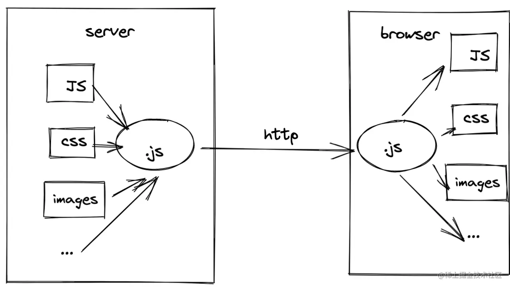
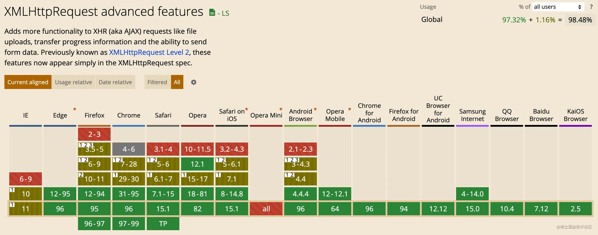
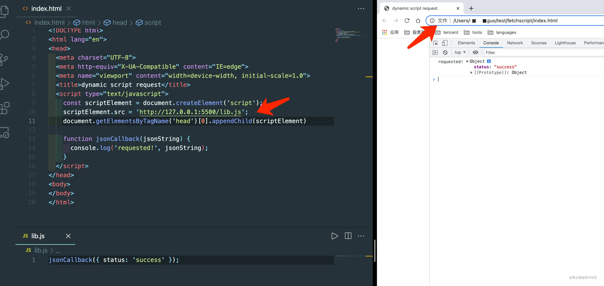

# Web 数据传输的方式

修改于 2021-12-24 11:38:57

1.2K0

举报

文章被收录于专栏：各类技术文章~



## 前言

Web 发展至今，通常情况的数据传输方式是通过 Ajax 进行数据通信。除了 Ajax 传输JSON之外，还有很多其他的通信方式。本文将以 请求数据、发送数据和数据格式的角度，来介绍 Web 数据传输的方式和类型。

## 请求数据 (Request Data)

通常是 Web 向[服务器](https://cloud.tencent.com/product/cvm/?from_column=20065&from=20065)请求资源时的动作。

### XMLHttpRequest

`XMLHttpRequest` 是目前最常用的技术，允许异步发送请求。XMLHttpRequest 是 `axios` 的基石。可以这样使用:

代码语言：javascript

复制

```javascript
const url = 'https://blog.gdccwxx.com'
const req = new XMLHttpRequest();

req.onreadystatechange = () => {
    if (req.readyState === 4) { // request done
        const responseHeader = req.getAllResponseHeaders();
        const data = req.responseText;
        console.log(data);
    }
    if (req.readyState === 3) { // requesting
        const responseHeader = req.getAllResponseHeaders();
        const data = req.responseText;
        console.log('requesting', data);
    }
};

req.open('GET', url, true);
req.setRequestHeader('X-Requested-With', 'XMLHttpRequest');
req.send(null);
复制代码
```

通过 `new XMLHttpRequest()` 来创建请求实例; 使用 `open()` 和 `send()` 方法发送请求; `readyState` 代表请求状态，3 是请求中，4是请求完成; `onreadystatechange()` 来监听请求状态的变化，通过监听 readyState 来判断请求当前的状态。

对只会获取数据，不会改变服务状态的行为，尽量使用 `GET` 方法。因为 `GET` 请求方法会被缓存起来。对同一请求会有性能的提升。只有当 `URL` 请求长度接近或超过 `2048` 个字节时才需要换成 POST。部分浏览器会 `URL` 超长截断。

同时他的支持也非常友好，几乎各大浏览器厂商支持率都非常高。是异步获取数据的不二之选。



### Fetch

相比事件监听的 `XMLHttpRequest`, `fetch` 的 API 更加优美。它的 `Promise` 化的方式不仅语法简洁，同时支持 `Service Workers` 和 `Cache API` 等场景。

感受下使用的简洁：

代码语言：javascript

复制

```javascript
const data = await fetch('https://blog.gdccwxx.com', {
    method: 'GET',
    'Content-Type': 'text/plain',
});
console.log('data', data);
复制代码
```

`fetch` 的第一个参数代表请求的`url`; 第二个参数代表`配置项`，可配置请求方法、响应内容类型等。

他的支持虽然没有 `XMLHttpRequest` 好，对于基础场景还是绰绰有余。demo 页面的完美解决方案。


### 动态脚本注入

相比上面两种的常规方式，动态脚本注入算是一种异类。这种方式最大的好处是：克服了`XHR` 最大的限制: 能跨域请求数据。可以这样做：

代码语言：javascript

复制

```javascript
// index.html
const scriptElement = document.createElement('script');
scriptElement.src = 'http://127.0.0.1:5500/lib.js';
document.getElementsByTagName('head')[0].appendChild(scriptElement)

function jsonCallback(jsonString) {
  console.log('requested!', jsonString);
}


// 127.0.0.1:5500/lib.js
jsonCallback({ status: 'success' });
复制代码
```

例如： 


此用例是的特点：

- html 文件是本地静态文件
- lib 文件是跨域文件

不过，这项技术虽然能够解决跨域问题，但动态注入的代码能完全控制整个页面。包括修改网页内容，重定向到其他网站等。**因此引入外部来源的代码时要多加小心。**

### Multipart XHR

`Multipart XHR` 允许客户端用一个 `HTTP` 请求，就可以从服务器传输多个资源。它通过在服务端将资源打包成双方约定的字符串分割的长字符串。然后用JS 处理这个字符串，并根据 `mime-type` 类型和传入其他的头信息，并解析出来。



他和 `HTTP2` 的静态推送有些类似，不同的是 `HTTP2` 静态推送的按照资源级别主动推送，无需 `js` 解析；而 `Multipart XHR` 将文件打包成一个，在浏览器端通过 `JS` 方式解析。

这种方式虽然可以完全被 `HTTP2` 替代，但为了减少资源请求而减少 `http` 握手的思维方式值得借鉴。

## 发送数据（Sending Data）

有些时候并不关心接收数据，只需要将数据发送到服务器即可。例如发送上报，行为记录，捕获错误等。当数据只需要发送到服务器时，有两种广泛使用的技术：XHR 和 信标。

### XMLHttpRequest、Fetch 方式

这种方式无须多言，在少量数据时使用 `GET`方式，因为GET请求往往只发送一个数据包，而 `POST` 则是2个，包括头**信息**和**正文**。大量数据使用 `POST` ，超长 `URL` 会被截断。

### 信标方式(Beacons)

这种技术和动态脚本注入非常类似，使用 `JS` 创建 `Image` 对象，把 `src` 属性设置为上报的 `URL` ，这个其中包含了要通过 `GET` 传回的键值对数据。

代码语言：javascript

复制

```javascript
const url = 'https://blog.gdccwxx.com';
const params = [ 'result=true']

(new Image()).src = `${url}?${params.join('&')}`;
复制代码
```

这样服务器会接受到数据并保存下来，无需反馈任何信息。这是给服务器传消息的最有效的方式，因为性能消耗很小，而且服务端出错完全不会影响客户端。

不过因为这种方式很简单，意味着做的事情也是有限的。

- 无法发送 `POST` 数据， `URL` 有长度限制
- 可以接受服务器的数据，但是很局限。例如通过监听 `image` 的宽度等

如果无需大量数据上传到服务器，也无需关心响应正文，信标方式时一种非常完美的解决方案。如果需要，那么 `XMLHttpRequest` 和 `fetch` 是更好的选择。

## 数据格式 （Data Formats）

考虑数据传输技术时，必须考虑数据的传输速度。而相同数据在不同数据格式下的大小并不一样，因此如何选择数据格式成为了传输速度的关键。

### XML

在 `Ajax` 流行之初，选择了 `XML` 作为通用数据格式，他有很多优点：优秀的通用性，格式严格容易验证，因此当时几乎所有服务器都支持 `XML` 格式。

下面是 `XML` 例子：

代码语言：javascript

复制

```javascript
<? xml version="1.0" encoding="utf-8">
<user id="gdccwxx">
    <username>gdccwxx</username>
    <email>gdccwxx@gmail.com</email>
    <blog>blog.gdccwxx.com</blog>
</user>
复制代码
```

相比其它格式， `XML` 十分冗长吗，而且语法有些模糊。在解析过程中，必须先知道 `XML` 的布局，才能弄清含义。而且也不容易解析：

代码语言：javascript

复制

```javascript
function parserXML(xml) {
    const user = xml.getElementsByTagName('user')[0];
    const id = user.getAttribute('id');
    const username = user.getElementsByTagName('username')[0].nodeValue ?? '';
    // ...
}
复制代码
```

### JSON

`JSON` 是一种使用JavaScript 对象的轻量级且易于解析的数据格式。表示同样的数据格式：

代码语言：javascript

复制

```javascript
{
  "user": {
    "id": "gdccwxx",
    "username": "gdccwxx",
    "email": "gdccwxx@gmail.com",
    "blog": "blog.gdccwxx.com",
  }
}
复制代码
```

它转化为`JS` `Object` 非常简单, 原生`JS` 方式：

代码语言：javascript

复制

```javascript
function parseJSON(text) {
  return eval(`(${text})`);
}

// or

JSON.parse(text);
复制代码
```

`JSON` 方式是一种非常通用、非常简洁的一种格式。

### HTML

`HTML` 不仅可以展示成页面，也是一种数据传输的格式。虽然他是一种较为臃肿的数据格式，甚至比 `XML` 还要复杂的多。不过在页面服务端渲染上，他是不错的选择。下面看个数据传输的例子：

代码语言：javascript

复制

```javascript
<ul>
  <li class="user" id="gdccwxx">
    <span>gdccwxx</span>
    <a href="mailto:gdccwxx@gmail.com">gdccwxx@gmail.com</a>
    <a href="https://blog.gdccwxx.com">blog.gdccwxx.com</a>
  </li>
</ul>
复制代码
```

### 自定义格式

理想的数据结构应该是只包含必要的结构，可以简单的包裹起来。例如：

代码语言：javascript

复制

```javascript
1:gdccwxx;gdccwxx@gmail.com;blog.gdccwxx.com
复制代码
```

这种数据结构相当简洁，能够非常快速的下载，相比任何通用结构都简洁很多。

解析：

代码语言：javascript

复制

```javascript
function parseCustomType(str) {
  const [, content] = str.split(':');
  const [user, mail, blog] = content.split(';');
  return { user, mail, blog };
}
复制代码
```

但这种方式的通用性并不高，对一些要求极致速度的业务是不错的方案。

从形态上很容易判断出，他们的传输速度排序如下：

代码语言：javascript

复制

```javascript
自定义格式 > JSON > XML > HTML
复制代码
```

通用性如下：

代码语言：javascript

复制

```javascript
JSON > XML > HTML > 自定义格式
复制代码
```

`JSON` 类型在通用和传输速度上都有着不错的表现，也在几乎可以说对比中完获胜。

## 结束语

相比10年前的web时代的诸多不确定性，我们这个时代简直是站在巨人的肩膀上看世界。不过也是因为 Web 请求方式上逐渐面临大一统，现代web也缺少了许多灵动性。

想起前段时间和客户端专家大佬聊天，他表示现在 web 越来越像客户端，而客户端越来越偏web。不禁让我深思：10年后的web会是怎样呢？是 web2.0 时代的灵动轻快？还是 facebook 客户端式的齐全和完整？时间会证明吧～

本文系转载，前往查看

如有侵权，请联系 [cloudcommunity@tencent.com](mailto:cloudcommunity@tencent.com) 删除。