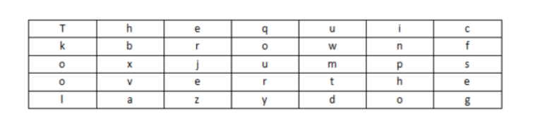
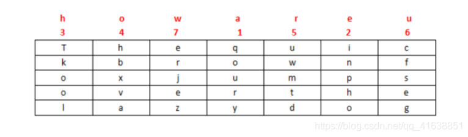
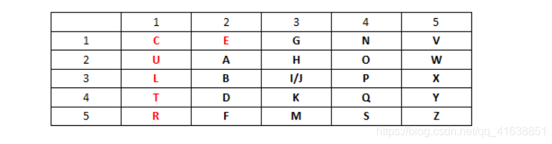
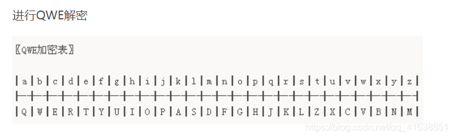
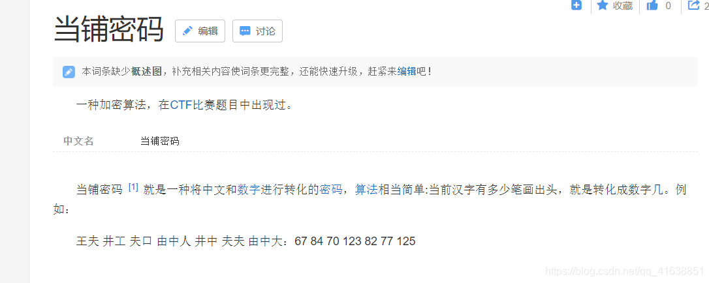
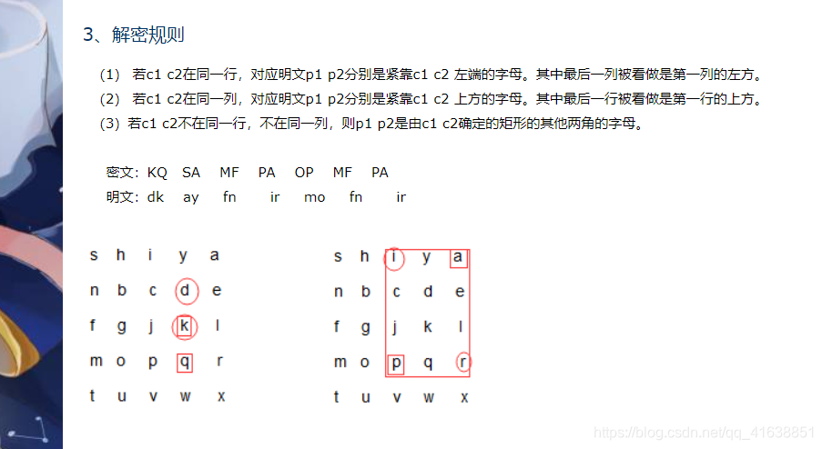
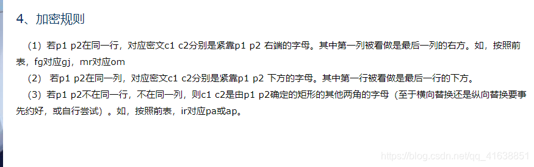

[blog.csdn.net](https://blog.csdn.net/qq_41638851/article/details/100526839)

# CTF中常见密码题解密网站总结_ctf解密网站-CSDN博客

成就一亿技术人!

7-9 分钟

------

#### 文章目录

- - - [0x00.综合](about:reader?url=https%3A%2F%2Fblog.csdn.net%2Fqq_41638851%2Farticle%2Fdetails%2F100526839#0x00_5)
    - [0x01.文字倒序排列](about:reader?url=https%3A%2F%2Fblog.csdn.net%2Fqq_41638851%2Farticle%2Fdetails%2F100526839#0x01_10)
    - [0x02.cmd5解密](about:reader?url=https%3A%2F%2Fblog.csdn.net%2Fqq_41638851%2Farticle%2Fdetails%2F100526839#0x02cmd5_12)
    - [0x03.](about:reader?url=https%3A%2F%2Fblog.csdn.net%2Fqq_41638851%2Farticle%2Fdetails%2F100526839#0x03_17)
    - - [①base64解密](about:reader?url=https%3A%2F%2Fblog.csdn.net%2Fqq_41638851%2Farticle%2Fdetails%2F100526839#base64_18)
      - [②base32解密](about:reader?url=https%3A%2F%2Fblog.csdn.net%2Fqq_41638851%2Farticle%2Fdetails%2F100526839#base32_23)
    - [0x04.ROT5、ROT13、ROT18、ROT47位移编码](about:reader?url=https%3A%2F%2Fblog.csdn.net%2Fqq_41638851%2Farticle%2Fdetails%2F100526839#0x04ROT5ROT13ROT18ROT47_25)
    - [0x05.颜文字（aadecode）](about:reader?url=https%3A%2F%2Fblog.csdn.net%2Fqq_41638851%2Farticle%2Fdetails%2F100526839#0x05aadecode_27)
    - [0x06.邮件编码（UUencode：M=75E;F-O9&7HOYGDN*KED）](about:reader?url=https%3A%2F%2Fblog.csdn.net%2Fqq_41638851%2Farticle%2Fdetails%2F100526839#0x06UUencodeM75EFO97HOYGDNKED_31)
    - [0x07.查尔斯加密（playfair解密）](about:reader?url=https%3A%2F%2Fblog.csdn.net%2Fqq_41638851%2Farticle%2Fdetails%2F100526839#0x07playfair_34)
    - [0x08.在线编码解码](about:reader?url=https%3A%2F%2Fblog.csdn.net%2Fqq_41638851%2Farticle%2Fdetails%2F100526839#0x08_36)
    - [0x09.进制间转换](about:reader?url=https%3A%2F%2Fblog.csdn.net%2Fqq_41638851%2Farticle%2Fdetails%2F100526839#0x09_38)
    - [0x010.16进与文本转换](about:reader?url=https%3A%2F%2Fblog.csdn.net%2Fqq_41638851%2Farticle%2Fdetails%2F100526839#0x01016_40)
    - [0x011.Unicode编码转换（4种）](about:reader?url=https%3A%2F%2Fblog.csdn.net%2Fqq_41638851%2Farticle%2Fdetails%2F100526839#0x011Unicode4_43)
    - [0xc12.Brainfuck（++++++++++++[>++++>）](about:reader?url=https%3A%2F%2Fblog.csdn.net%2Fqq_41638851%2Farticle%2Fdetails%2F100526839#0xc12Brainfuck_51)
    - [0x013.URL（%23）](about:reader?url=https%3A%2F%2Fblog.csdn.net%2Fqq_41638851%2Farticle%2Fdetails%2F100526839#0x013URL23_55)
    - [0x014.二维码生成/解码器](about:reader?url=https%3A%2F%2Fblog.csdn.net%2Fqq_41638851%2Farticle%2Fdetails%2F100526839#0x014_59)
    - [0x015.摩斯密码](about:reader?url=https%3A%2F%2Fblog.csdn.net%2Fqq_41638851%2Farticle%2Fdetails%2F100526839#0x015_62)
    - [0x016.quipqiup](about:reader?url=https%3A%2F%2Fblog.csdn.net%2Fqq_41638851%2Farticle%2Fdetails%2F100526839#0x016quipqiup_66)
    - [0x017.与佛论禅](about:reader?url=https%3A%2F%2Fblog.csdn.net%2Fqq_41638851%2Farticle%2Fdetails%2F100526839#0x017_68)
    - [0x018.xxencode(Ri64NjS0-eRKpkQm-jRaJm6)](about:reader?url=https%3A%2F%2Fblog.csdn.net%2Fqq_41638851%2Farticle%2Fdetails%2F100526839#0x018xxencodeRi64NjS0eRKpkQmjRaJm6_70)
    - [0x019.jsfuck（[\][(![]+[])[+[]）](about:reader?url=https%3A%2F%2Fblog.csdn.net%2Fqq_41638851%2Farticle%2Fdetails%2F100526839#0x019jsfuck_72)
    - [0x020.UTF-8编码(安)](about:reader?url=https%3A%2F%2Fblog.csdn.net%2Fqq_41638851%2Farticle%2Fdetails%2F100526839#0x020UTF8x5B89_76)
    - [0x021.DES(要密匙)](about:reader?url=https%3A%2F%2Fblog.csdn.net%2Fqq_41638851%2Farticle%2Fdetails%2F100526839#0x021DES_82)
    - [0x022.凯撒](about:reader?url=https%3A%2F%2Fblog.csdn.net%2Fqq_41638851%2Farticle%2Fdetails%2F100526839#0x022_85)
    - [0x023.Rabbit（兔子）解密](about:reader?url=https%3A%2F%2Fblog.csdn.net%2Fqq_41638851%2Farticle%2Fdetails%2F100526839#0x023Rabbit_88)
    - [0x024.AES](about:reader?url=https%3A%2F%2Fblog.csdn.net%2Fqq_41638851%2Farticle%2Fdetails%2F100526839#0x024AES_92)
    - [0x025.JS解密](about:reader?url=https%3A%2F%2Fblog.csdn.net%2Fqq_41638851%2Farticle%2Fdetails%2F100526839#0x025JS_96)
    - [0x026.ASP解密](about:reader?url=https%3A%2F%2Fblog.csdn.net%2Fqq_41638851%2Farticle%2Fdetails%2F100526839#0x026ASP_99)
    - [0x027.Snake解密（要密匙）](about:reader?url=https%3A%2F%2Fblog.csdn.net%2Fqq_41638851%2Farticle%2Fdetails%2F100526839#0x027Snake_102)
    - [0x028.GRB与十六进制的转换](about:reader?url=https%3A%2F%2Fblog.csdn.net%2Fqq_41638851%2Farticle%2Fdetails%2F100526839#0x028GRB_104)
    - [0x029.html隐写在线解密](about:reader?url=https%3A%2F%2Fblog.csdn.net%2Fqq_41638851%2Farticle%2Fdetails%2F100526839#0x029html_107)
    - [0x030.shellcode编码（\x54\x68\x65\x7f）](about:reader?url=https%3A%2F%2Fblog.csdn.net%2Fqq_41638851%2Farticle%2Fdetails%2F100526839#0x030shellcodex54x68x65x7f_110)
    - [0x031.Quoted-printable编码](about:reader?url=https%3A%2F%2Fblog.csdn.net%2Fqq_41638851%2Farticle%2Fdetails%2F100526839#0x031Quotedprintable_112)
    - [0x032.Escape/Unescape编码（%u0054%u0068%u0065）](about:reader?url=https%3A%2F%2Fblog.csdn.net%2Fqq_41638851%2Farticle%2Fdetails%2F100526839#0x032EscapeUnescapeu0054u0068u0065_118)
    - [0x032.敲击码(Tap code)](about:reader?url=https%3A%2F%2Fblog.csdn.net%2Fqq_41638851%2Farticle%2Fdetails%2F100526839#0x032Tap_code_120)
    - [0x033.加密为汉字](about:reader?url=https%3A%2F%2Fblog.csdn.net%2Fqq_41638851%2Farticle%2Fdetails%2F100526839#0x033_127)
    - [0x034.栅栏](about:reader?url=https%3A%2F%2Fblog.csdn.net%2Fqq_41638851%2Farticle%2Fdetails%2F100526839#0x034_129)
    - [0x035.曲路密码](about:reader?url=https%3A%2F%2Fblog.csdn.net%2Fqq_41638851%2Farticle%2Fdetails%2F100526839#0x035_132)
    - [0x036.列移位密码](about:reader?url=https%3A%2F%2Fblog.csdn.net%2Fqq_41638851%2Farticle%2Fdetails%2F100526839#0x036_135)
    - [0x037.埃特巴什码](about:reader?url=https%3A%2F%2Fblog.csdn.net%2Fqq_41638851%2Farticle%2Fdetails%2F100526839#0x037_139)
    - [0x038.希尔密码（利用矩阵）](about:reader?url=https%3A%2F%2Fblog.csdn.net%2Fqq_41638851%2Farticle%2Fdetails%2F100526839#0x038_142)
    - [0x039.夏多密码(曲折加密)](about:reader?url=https%3A%2F%2Fblog.csdn.net%2Fqq_41638851%2Farticle%2Fdetails%2F100526839#0x039_144)
    - [0x040.编制密码表](about:reader?url=https%3A%2F%2Fblog.csdn.net%2Fqq_41638851%2Farticle%2Fdetails%2F100526839#0x040_146)
    - [0x041.维吉尼亚密码](about:reader?url=https%3A%2F%2Fblog.csdn.net%2Fqq_41638851%2Farticle%2Fdetails%2F100526839#0x041_151)
    - [0x042.自动密钥密码](about:reader?url=https%3A%2F%2Fblog.csdn.net%2Fqq_41638851%2Farticle%2Fdetails%2F100526839#0x042_155)
    - [0x043.博福特密码](about:reader?url=https%3A%2F%2Fblog.csdn.net%2Fqq_41638851%2Farticle%2Fdetails%2F100526839#0x043_157)
    - [0x044.滚动密钥密码](about:reader?url=https%3A%2F%2Fblog.csdn.net%2Fqq_41638851%2Farticle%2Fdetails%2F100526839#0x044_159)
    - [0x045.Porta密码](about:reader?url=https%3A%2F%2Fblog.csdn.net%2Fqq_41638851%2Farticle%2Fdetails%2F100526839#0x045Porta_161)
    - [0x046.仿射密码](about:reader?url=https%3A%2F%2Fblog.csdn.net%2Fqq_41638851%2Farticle%2Fdetails%2F100526839#0x046_163)
    - [0x047.培根密码](about:reader?url=https%3A%2F%2Fblog.csdn.net%2Fqq_41638851%2Farticle%2Fdetails%2F100526839#0x047_166)
    - [0x048.ADFGX密码](about:reader?url=https%3A%2F%2Fblog.csdn.net%2Fqq_41638851%2Farticle%2Fdetails%2F100526839#0x048ADFGX_169)
    - [0x049.双密码](about:reader?url=https%3A%2F%2Fblog.csdn.net%2Fqq_41638851%2Farticle%2Fdetails%2F100526839#0x049_171)
    - [0x050.ppencode](about:reader?url=https%3A%2F%2Fblog.csdn.net%2Fqq_41638851%2Farticle%2Fdetails%2F100526839#0x050ppencode_174)
    - [0x051.rrencode(把ruby代码全部转换成符号)](about:reader?url=https%3A%2F%2Fblog.csdn.net%2Fqq_41638851%2Farticle%2Fdetails%2F100526839#0x051rrencoderuby_177)
    - [0x052.jother](about:reader?url=https%3A%2F%2Fblog.csdn.net%2Fqq_41638851%2Farticle%2Fdetails%2F100526839#0x052jother_178)
    - [0x053.CR4解密](about:reader?url=https%3A%2F%2Fblog.csdn.net%2Fqq_41638851%2Farticle%2Fdetails%2F100526839#0x053CR4_181)
    - [0x054.VBScript](about:reader?url=https%3A%2F%2Fblog.csdn.net%2Fqq_41638851%2Farticle%2Fdetails%2F100526839#0x054VBScript_184)
    - [0x055.执行php文件](about:reader?url=https%3A%2F%2Fblog.csdn.net%2Fqq_41638851%2Farticle%2Fdetails%2F100526839#0x055php_187)
    - [0x056.图片/BASE64转换](about:reader?url=https%3A%2F%2Fblog.csdn.net%2Fqq_41638851%2Farticle%2Fdetails%2F100526839#0x056BASE64_189)
    - [0x057.QWE解密](about:reader?url=https%3A%2F%2Fblog.csdn.net%2Fqq_41638851%2Farticle%2Fdetails%2F100526839#0x057QWE_191)
    - [0x058.当铺密码](about:reader?url=https%3A%2F%2Fblog.csdn.net%2Fqq_41638851%2Farticle%2Fdetails%2F100526839#0x058_193)
    - [0x059.RSA算法](about:reader?url=https%3A%2F%2Fblog.csdn.net%2Fqq_41638851%2Farticle%2Fdetails%2F100526839#0x059RSA_195)
    - [0x060.词频分析](about:reader?url=https%3A%2F%2Fblog.csdn.net%2Fqq_41638851%2Farticle%2Fdetails%2F100526839#0x060_197)
    - [0x061.加盐密码算法](about:reader?url=https%3A%2F%2Fblog.csdn.net%2Fqq_41638851%2Farticle%2Fdetails%2F100526839#0x061_199)
    - [0x062.play fair密码](about:reader?url=https%3A%2F%2Fblog.csdn.net%2Fqq_41638851%2Farticle%2Fdetails%2F100526839#0x062play_fair_202)

#### 0x00.综合

网站中包含大多编码的解码。
 http://web2hack.org/xssee/
 https://www.sojson.com/
 http://web.chacuo.net/

#### 0x01.文字倒序排列

http://www.qqxiuzi.cn/zh/daoxu/

#### 0x02.cmd5解密

http://www.cmd5.com/
 http://pmd5.com/
 http://tool.chinaz.com/Tools/MD5.aspx
 http://md5jiami.51240.com/

#### 0x03.

##### ①base64解密

http://tool.chinaz.com/Tools/Base64.aspx
 http://www1.tc711.com/tool/BASE64.htm
 http://base64.supfree.net/
 http://web.chacuo.net/charsetbase64

##### ②base32解密

http://tomeko.net/online_tools/base32.php?lang=en

#### 0x04.ROT5、ROT13、ROT18、ROT47位移编码

http://www.qqxiuzi.cn/bianma/ROT5-13-18-47.php

#### 0x05.颜文字（aadecode）

打开谷歌浏览器–>F12–>点击Console–>粘贴复制回车就会出现答案
 https://cat-in-136.github.io/2010/12/aadecode-[decode](https://so.csdn.net/so/search?q=decode&spm=1001.2101.3001.7020)-encoded-as-aaencode.html
 http://utf-8.jp/public/aaencode.html

#### 0x06.邮件编码（UUencode：M=75E;F-O9&7HOYGDN*KED）

http://web.chacuo.net/charsetuuencode
 http://www.mxcz.net/tools/UUEncode.aspx

#### 0x07.查尔斯加密（playfair解密）

http://rumkin.com/tools/cipher/playfair.php

#### 0x08.在线编码解码

http://bianma.911cha.com/

#### 0x09.进制间转换

http://tool.oschina.net/hexconvert/

#### 0x010.16进与文本转换

http://www.5ixuexiwang.com/str/from-hex.php
 http://www.5ixuexiwang.com/str/hex.php

#### 0x011.Unicode编码转换（4种）

&#x [Hex]： The
 &# [Decimal]： The
 \U [Hex]： \U0054\U0068\U0065
 \U+ [Hex]： \U+0054\U+0068\U+0065
 http://tool.oschina.net/encode?type=3 （\u5927）
 http://tool.chinaz.com/tools/unicode.aspx （\u5927）
 http://tool.oschina.net/encode （安）

#### 0xc12.Brainfuck（++++++++++++[>++++>）

https://www.splitbrain.org/services/ook （Ook!与Brainfuck）
 https://www.nayuki.io/page/brainfuck-interpreter-javascript
 http://esoteric.sange.fi/brainfuck/impl/interp/i.html

#### 0x013.URL（%23）

http://tool.chinaz.com/tools/urlencode.aspx
 http://web.chacuo.net/charseturlencode
 http://tool.oschina.net/encode?type=4

#### 0x014.二维码生成/解码器

http://tool.chinaz.com/qrcode/
 http://jiema.wwei.cn/

#### 0x015.摩斯密码

http://www.zou114.com/mesm/
 http://www.jb51.net/tools/morse.htm
 http://rumkin.com/tools/cipher/morse.php

#### 0x016.quipqiup

https://www.xarg.org/tools/caesar-cipher/

#### 0x017.与佛论禅

http://www.keyfc.net/bbs/tools/tudoucode.aspx

#### 0x018.xxencode(Ri64NjS0-eRKpkQm-jRaJm6)

http://web.chacuo.net/charsetxxencode

#### 0x019.jsfuck（[][(![]+[])[+[]）

注：用  ! +加密
 打开谷歌浏览器–>F12–>点击Console–>粘贴复制回车就会出现答案
 http://discogscounter.getfreehosting.co.uk/js-noalnum.php?ckattempt=1&i=1（放在下面的大框里，点击eval(–v)）

#### 0x020.UTF-8编码(安)

http://tool.chinaz.com/Tools/UTF-8.aspx
 http://tool.oschina.net/encode?type=2

http://www.3464.com/Tools/HtmlToOther/

#### 0x021.DES(要密匙)

http://encode.chahuo.com/
 http://tool.oschina.net/encrypt/

#### 0x022.凯撒

http://www.zjslove.com/3.decode/kaisa/index.html
 http://planetcalc.com/1434/

#### 0x023.Rabbit（兔子）解密

注：此编码与和base64很相似
 http://tool.chinaz.com/Tools/TextEncrypt.aspx
 http://tool.oschina.net/encrypt/

#### 0x024.AES

部分例子：U2FsdGVkX1+qtU8KEGmMJwGgKcPUK3XBTdM+KhNRLHSCQL2nSXaW8++yBUkSylRp
 http://tool.oschina.net/encrypt/
 http://aes.online-domain-tools.com/

#### 0x025.JS解密

http://www.haokuwang.com/jsendecode.htm
 http://www.dheart.net/decode/index.php

#### 0x026.ASP解密

部分例子：#@^EQAAAA==VXlj4UmkaYAUmKN3bAYAAA==^#@
 http://adophper.com/encode.html

#### 0x027.Snake解密（要密匙）

http://serpent.online-domain-tools.com/

#### 0x028.GRB与十六进制的转换

http://www.sioe.cn/yingyong/yanse-rgb-16/
 http://www.atool.org/colorpicker.php

#### 0x029.html隐写在线解密

注：密匙和网址
 http://fog.misty.com/perry/ccs/snow/snow/snow.html

#### 0x030.shellcode编码（\x54\x68\x65\x7f）

http://www.jb51.net/article/10399.htm

#### 0x031.Quoted-printable编码

我们收邮件，查看信件原始信息，经常会看到这种类型的编码！（=E6=95=8F=E6=8D=B7=E7=9A）
 function quoted_printable_encode($[string](https://marketing.csdn.net/p/3127db09a98e0723b83b2914d9256174?pId=2782&utm_source=glcblog&spm=1001.2101.3001.7020)) {
 return preg_replace(‘/[\r\n]{73}[=\r\n]{2}/‘, "KaTeX parse error: Can't use function '\r' in math mode at position 3: 0=\̲r̲\n", str_replac…string)));
 }

#### 0x032.Escape/Unescape编码（%u0054%u0068%u0065）

https://escape.supfree.net/

#### 0x032.敲击码(Tap code)

1 2 3 4 5
 1 A B C/K D E
 2 F G H I J
 3 L M N O P
 4 Q R S T U
 5 V W X Y Z

#### 0x033.加密为汉字

http://www.qqxiuzi.cn/bianma/wenbenjiami.php

#### 0x034.栅栏

http://www.practicalcryptography.com/ciphers/classical-era/rail-fence/
 http://www.atoolbox.net/Tool.php?Id=777

#### 0x035.曲路密码

需要事先双方约定密钥(也就是曲路路径)
 

#### 0x036.列移位密码

 密钥： how are u
 密文： qoury inpho Tkool hbxva uwmtd cfseg erjez

#### 0x037.埃特巴什码

ABCDEFGHIJKLMNOPQRSTUVWXYZ ZYXWVUTSRQPONMLKJIHGFEDCBA
 http://www.practicalcryptography.com/ciphers/classical-era/atbash-cipher/

#### 0x038.希尔密码（利用矩阵）

http://www.practicalcryptography.com/ciphers/hill-cipher/

#### 0x039.夏多密码(曲折加密)

技术分享图片

#### 0x040.编制密码表

注：如果出现"Z"，则需要去除，因为在英文里"Z"的使用频率最低，相应的如果是德文，则需将"I"与"J"当作一个字母来看待，而法语则去掉"W"或"K"。
 整理密钥字母 C U L T U R E ，去掉后面重复的字母得到： C U L T R E
 
 http://www.practicalcryptography.com/ciphers/classical-era/playfair/

#### 0x041.维吉尼亚密码

http://planetcalc.com/2468/（已知密匙）
 http://rumkin.com/tools/cipher/gronsfeld.php（未知密匙）
 http://www.zjslove.com/3.decode/weijiniya/index.html

#### 0x042.自动密钥密码

http://www.practicalcryptography.com/ciphers/classical-era/autokey/

#### 0x043.博福特密码

http://www.practicalcryptography.com/ciphers/classical-era/beaufort/

#### 0x044.滚动密钥密码

http://www.practicalcryptography.com/ciphers/classical-era/running-key/

#### 0x045.Porta密码

http://www.practicalcryptography.com/ciphers/classical-era/porta/

#### 0x046.仿射密码

以E(x) = (5x + 8) mod 26加密，通过计算可得D(x)=21(x - 8) mod 26，这样便可以得到明文。
 http://www.practicalcryptography.com/ciphers/classical-era/affine/

#### 0x047.培根密码

http://rumkin.com/tools/cipher/baconian.php
 https://netair.xyz/tools/培根密码加密解密.html

#### 0x048.ADFGX密码

http://www.practicalcryptography.com/ciphers/adfgx-cipher/

#### 0x049.双密码

明文: THE QUICK BROWN FOX=>5121542133 5435452521 3523311521 34 =>密文: WETED TKZNE KYOME X
 http://www.practicalcryptography.com/ciphers/classical-era/bifid/

#### 0x050.ppencode

把Perl代码转换成只有英文字母的字符串
 http://namazu.org/~takesako/ppencode/demo.html

#### 0x051.rrencode(把ruby代码全部转换成符号)

#### 0x052.jother

可以在浏览器(IE可以)的控制台里输入密文即可执行解密（用! + ( ) [ ] { }加密）
 http://tmxk.org/jother/（编码）

#### 0x053.CR4解密

http://tool.oschina.net/encrypt
 http://tool.chinaz.com/Tools/TextEncrypt.aspx

#### 0x054.VBScript

部分例子：#@^TgAAAA==‘[6*liLa6++p‘aXvfiLaa6i[[avWi[[a*p[[6*!I‘[6cp‘aXvXILa6fp[:6+Wp[:XvWi[[6+XivRIAAA==^#@
 http://www.dheart.net/decode/index.php

#### 0x055.执行php文件

https://www.shucunwang.com/RunCode/php/

#### 0x056.图片/BASE64转换

http://tool.oschina.net/encrypt?type=4

#### 0x057.QWE解密

#### 0x058.当铺密码

#### 0x059.RSA[算法](https://edu.csdn.net/course/detail/40020?utm_source=glcblog&spm=1001.2101.3001.7020)

http://www.factordb.com/index.php

#### 0x060.词频分析

https://www.quipqiup.com

#### 0x061.加盐密码算法

https://blog.csdn.net/JBlock/article/details/78446604

#### 0x062.play fair密码

http://rumkin.com/tools/cipher/playfair.php
 https://www.cnblogs.com/xdjun/p/7469841.html
 
 