[blog.csdn.net](https://blog.csdn.net/qq_40837276/article/details/83080460)

# CTF密码学常见加密解密总结_wydfxjmgvswodododod-CSDN博客

成就一亿技术人!

53-67 分钟

------

## CTF密码学常见加密解密总结

被实验吧一堆大佬出题人折磨的死去活来的我，嘤嘤嘤。在此做个总结，防止自己忘掉：

由下面这张思维导图进行扩展：
 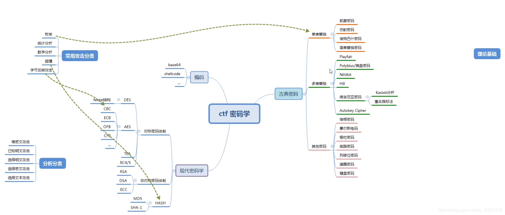
 参考:
 作者：adversity` 来源：CSDN 原文：https://blog.csdn.net/qq_40836553/article/details/79383488
 作者：大龙博客 来源：CSDN 原文：https://blog.csdn.net/gelong_bokewang/article/details/88527929
 作者：前端弟弟 来源：CSDN 原文：https://blog.csdn.net/qq_41681743/article/details/82700911

#### 目录

- [CTF密码学常见加密解密总结](about:reader?url=https%3A%2F%2Fblog.csdn.net%2Fqq_40837276%2Farticle%2Fdetails%2F83080460#CTF_0)
- [编码：](about:reader?url=https%3A%2F%2Fblog.csdn.net%2Fqq_40837276%2Farticle%2Fdetails%2F83080460#_13)
- - [1.Base64编码](about:reader?url=https%3A%2F%2Fblog.csdn.net%2Fqq_40837276%2Farticle%2Fdetails%2F83080460#1Base64_15)
  - [2 . jother编码](about:reader?url=https%3A%2F%2Fblog.csdn.net%2Fqq_40837276%2Farticle%2Fdetails%2F83080460#2__jother_44)
  - [3. unicode编码](about:reader?url=https%3A%2F%2Fblog.csdn.net%2Fqq_40837276%2Farticle%2Fdetails%2F83080460#3_unicode_54)
  - [4.url编码（十六进制的%编码）](about:reader?url=https%3A%2F%2Fblog.csdn.net%2Fqq_40837276%2Farticle%2Fdetails%2F83080460#4url_64)
  - [5.hex编码](about:reader?url=https%3A%2F%2Fblog.csdn.net%2Fqq_40837276%2Farticle%2Fdetails%2F83080460#5hex_69)
  - [核心价值观编码解码](about:reader?url=https%3A%2F%2Fblog.csdn.net%2Fqq_40837276%2Farticle%2Fdetails%2F83080460#_93)
  - [16进制转字符串](about:reader?url=https%3A%2F%2Fblog.csdn.net%2Fqq_40837276%2Farticle%2Fdetails%2F83080460#16_96)
- [古典密码——单表替换](about:reader?url=https%3A%2F%2Fblog.csdn.net%2Fqq_40837276%2Farticle%2Fdetails%2F83080460#_98)
- - [1.凯撒密码](about:reader?url=https%3A%2F%2Fblog.csdn.net%2Fqq_40837276%2Farticle%2Fdetails%2F83080460#1_99)
  - [2.仿射密码](about:reader?url=https%3A%2F%2Fblog.csdn.net%2Fqq_40837276%2Farticle%2Fdetails%2F83080460#2_107)
  - [3.埃特巴什码(Atbash Cipher)](about:reader?url=https%3A%2F%2Fblog.csdn.net%2Fqq_40837276%2Farticle%2Fdetails%2F83080460#3Atbash_Cipher_177)
- [古典密码——多表替换](about:reader?url=https%3A%2F%2Fblog.csdn.net%2Fqq_40837276%2Farticle%2Fdetails%2F83080460#_187)
- - [1.playfair密码(Playfair cipher 或 Playfair square)](about:reader?url=https%3A%2F%2Fblog.csdn.net%2Fqq_40837276%2Farticle%2Fdetails%2F83080460#1playfairPlayfair_cipher__Playfair_square_189)
  - [2.棋盘密码（Polybius方表）](about:reader?url=https%3A%2F%2Fblog.csdn.net%2Fqq_40837276%2Farticle%2Fdetails%2F83080460#2Polybius_207)
  - [3.Nihilist 加密法](about:reader?url=https%3A%2F%2Fblog.csdn.net%2Fqq_40837276%2Farticle%2Fdetails%2F83080460#3Nihilist__223)
  - [4.Hill密码（希尔密码）](about:reader?url=https%3A%2F%2Fblog.csdn.net%2Fqq_40837276%2Farticle%2Fdetails%2F83080460#4Hill_230)
  - [4.维吉尼亚密码](about:reader?url=https%3A%2F%2Fblog.csdn.net%2Fqq_40837276%2Farticle%2Fdetails%2F83080460#4_241)
  - [Autokey Cipher(自动密钥密码)](about:reader?url=https%3A%2F%2Fblog.csdn.net%2Fqq_40837276%2Farticle%2Fdetails%2F83080460#Autokey_Cipher_254)
  - [ADFGVX密码](about:reader?url=https%3A%2F%2Fblog.csdn.net%2Fqq_40837276%2Farticle%2Fdetails%2F83080460#ADFGVX_319)
  - [词频分析](about:reader?url=https%3A%2F%2Fblog.csdn.net%2Fqq_40837276%2Farticle%2Fdetails%2F83080460#_356)
- [其他（有些不知道归类到哪，就丢这里啦~）](about:reader?url=https%3A%2F%2Fblog.csdn.net%2Fqq_40837276%2Farticle%2Fdetails%2F83080460#_358)
- - [1. Escape加密/UnEscape解密](about:reader?url=https%3A%2F%2Fblog.csdn.net%2Fqq_40837276%2Farticle%2Fdetails%2F83080460#1_EscapeUnEscape_359)
  - [2. eval(function(p,a,c,k,e,d)系列解密javascript程序](about:reader?url=https%3A%2F%2Fblog.csdn.net%2Fqq_40837276%2Farticle%2Fdetails%2F83080460#2_evalfunctionpackedjavascript_368)
  - [3.VBScript](about:reader?url=https%3A%2F%2Fblog.csdn.net%2Fqq_40837276%2Farticle%2Fdetails%2F83080460#3VBScript_374)
  - [4.猪圈密码](about:reader?url=https%3A%2F%2Fblog.csdn.net%2Fqq_40837276%2Farticle%2Fdetails%2F83080460#4_382)
  - [5.手机键盘加密](about:reader?url=https%3A%2F%2Fblog.csdn.net%2Fqq_40837276%2Farticle%2Fdetails%2F83080460#5_388)
  - [6.QWE密码](about:reader?url=https%3A%2F%2Fblog.csdn.net%2Fqq_40837276%2Farticle%2Fdetails%2F83080460#6QWE_392)
  - [7.曲路密码](about:reader?url=https%3A%2F%2Fblog.csdn.net%2Fqq_40837276%2Farticle%2Fdetails%2F83080460#7_409)
  - [8.盲文](about:reader?url=https%3A%2F%2Fblog.csdn.net%2Fqq_40837276%2Farticle%2Fdetails%2F83080460#8_419)
  - [9.当铺密码](about:reader?url=https%3A%2F%2Fblog.csdn.net%2Fqq_40837276%2Farticle%2Fdetails%2F83080460#9_425)
  - [10.Brainfuck(BF)](about:reader?url=https%3A%2F%2Fblog.csdn.net%2Fqq_40837276%2Farticle%2Fdetails%2F83080460#10BrainfuckBF_431)
  - [11.Ook!](about:reader?url=https%3A%2F%2Fblog.csdn.net%2Fqq_40837276%2Farticle%2Fdetails%2F83080460#11Ook_436)
  - [12.Piet](about:reader?url=https%3A%2F%2Fblog.csdn.net%2Fqq_40837276%2Farticle%2Fdetails%2F83080460#12Piet_440)
  - [13种荒谬的编程语言](about:reader?url=https%3A%2F%2Fblog.csdn.net%2Fqq_40837276%2Farticle%2Fdetails%2F83080460#13httpnewsmydriverscom1190190926htm_443)
  - [摩斯电码](about:reader?url=https%3A%2F%2Fblog.csdn.net%2Fqq_40837276%2Farticle%2Fdetails%2F83080460#_444)
- [现代密码学——Hash](about:reader?url=https%3A%2F%2Fblog.csdn.net%2Fqq_40837276%2Farticle%2Fdetails%2F83080460#Hash_447)
- - [MD5（哈希算法）](about:reader?url=https%3A%2F%2Fblog.csdn.net%2Fqq_40837276%2Farticle%2Fdetails%2F83080460#MD5_449)
- [现代密码学——非对称密码体系](about:reader?url=https%3A%2F%2Fblog.csdn.net%2Fqq_40837276%2Farticle%2Fdetails%2F83080460#_479)
- - [1.RSA](about:reader?url=https%3A%2F%2Fblog.csdn.net%2Fqq_40837276%2Farticle%2Fdetails%2F83080460#1RSA_480)
  - [2.DSA（Digital Signature Algorithm）](about:reader?url=https%3A%2F%2Fblog.csdn.net%2Fqq_40837276%2Farticle%2Fdetails%2F83080460#2DSADigital_Signature_Algorithm_506)
  - [ECC（Elliptic Curves Cryptography，椭圆曲线密码编码学）](about:reader?url=https%3A%2F%2Fblog.csdn.net%2Fqq_40837276%2Farticle%2Fdetails%2F83080460#ECCElliptic_Curves_Cryptography_519)
  - [serpent(蛇)加密/解密](about:reader?url=https%3A%2F%2Fblog.csdn.net%2Fqq_40837276%2Farticle%2Fdetails%2F83080460#serpent_527)
- [现代密码学——对称密码体系](about:reader?url=https%3A%2F%2Fblog.csdn.net%2Fqq_40837276%2Farticle%2Fdetails%2F83080460#_532)
- - [AES（Advanced Encryption Standard）](about:reader?url=https%3A%2F%2Fblog.csdn.net%2Fqq_40837276%2Farticle%2Fdetails%2F83080460#AESAdvanced_Encryption_Standard_540)
  - [1.CBC(Cipher Block Chaining)/密文分组链接方式](about:reader?url=https%3A%2F%2Fblog.csdn.net%2Fqq_40837276%2Farticle%2Fdetails%2F83080460#1CBCCipher_Block_Chaining_547)
  - [2.CFB（Cipher Feedback）/ 密文反馈模式](about:reader?url=https%3A%2F%2Fblog.csdn.net%2Fqq_40837276%2Farticle%2Fdetails%2F83080460#2CFBCipher_Feedback__584)
  - [3.ECB(Electronic Code Book)/电码本模式](about:reader?url=https%3A%2F%2Fblog.csdn.net%2Fqq_40837276%2Farticle%2Fdetails%2F83080460#3ECBElectronic_Code_Book_589)
  - [4.OFB (Output Feedback)/输出反馈模式](about:reader?url=https%3A%2F%2Fblog.csdn.net%2Fqq_40837276%2Farticle%2Fdetails%2F83080460#4OFB_Output_Feedback_600)
  - [DES](about:reader?url=https%3A%2F%2Fblog.csdn.net%2Fqq_40837276%2Farticle%2Fdetails%2F83080460#DES_608)
  - [TEA（Tiny Encryption Algorithm）](about:reader?url=https%3A%2F%2Fblog.csdn.net%2Fqq_40837276%2Farticle%2Fdetails%2F83080460#TEATiny_Encryption_Algorithm_614)
  - [RC4/5](about:reader?url=https%3A%2F%2Fblog.csdn.net%2Fqq_40837276%2Farticle%2Fdetails%2F83080460#RC45_618)

## 编码：

### 1.Base64编码

Base64是网络上最常见的用于传输8Bit字节码的编码方式之一，base64就是一种基于64个可打印字符来表示二进制数据的表示方法。由于2的6次方等于64，所以每6个比特为一个单元，对应某个可打印字符。三个字节有24个比特，对应4个base64单元，即3个字节可表示4个可打印字符。它可用来作为电子邮件的传输编码。

特征：(1)在base64中的可打印字符包括字母A-Z、a-z、数字0-9，+ / =。
 (2)永远是4的倍数，不足四的用=补齐。
 例如：编码‘Man’
 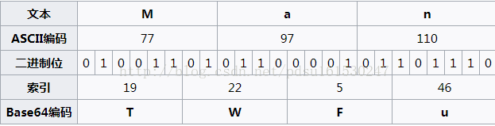
 在此例中，base64算法将3个字符编码转为4个字符
 base64索引表：
 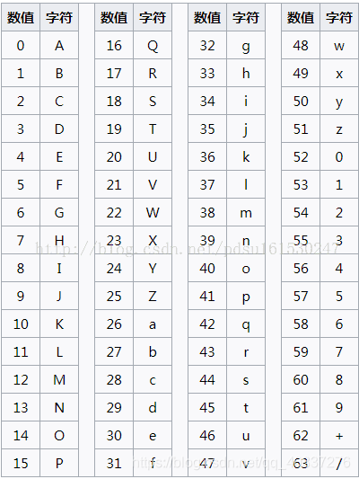
  如果要编码的字节数不能被3整除，最后会多出1个或2个字节，那么可以使用下面的方法进行处理：先使用0字节值在末尾补足，使其能够被3整除，然后再进行base64的编码。在编码后的base64文本后加上一个或两个“=”号，代表补足的字节数。也就是说，当最后剩余一个八位字节（一个byte）时，最后6位的base64字节块有四位是0值，最后附加上两个等号；如果最后剩余两个八位字节（2byte）时，最后一个6位的base字节块有两位是0值，最后附加一个等号
 例如：
 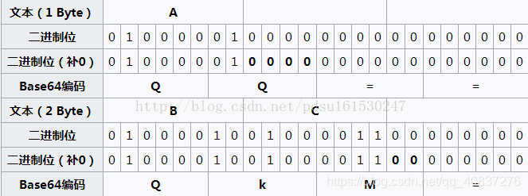
 当看到号的加密方式时，可以考虑base64。例：cTZ1NQ解码之后为q5u5。

关于base32：
 base32中只有大写字母（A-Z）和数字234567
 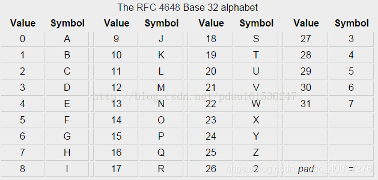

关于base16：
 base16中只有数字0-9以及大写字母ABCDEF
 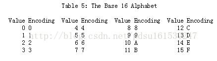

base64编码转图片: 在"data:image/gif;base64,"后加上Base64编码 [在线转图片即可](http://imgbase64.duoshitong.com/)
 [python3使用base64、base32、base16编码](https://blog.csdn.net/pdsu161530247/article/details/74840422)
 [在线解密](http://tool.chinaz.com/tools/base64.aspx)
 [Base系列解密](https://www.qqxiuzi.cn/bianma/base.php)

### 2 . jother编码

在javascript语言中，利用少量特定字符构造精简的匿名[函数](https://marketing.csdn.net/p/3127db09a98e0723b83b2914d9256174?pId=2782&utm_source=glcblog&spm=1001.2101.3001.7020)对与字符串的编码方式.代码中大量出现“+”、“！”、“（”、“）”、“[”、“]”、“{”、“}"字符

例如:!![]+!![]+!![]+!![]+!![]+!![]

[具体请看:](https://blog.csdn.net/greyfreedom/article/details/45070667)

谷歌浏览器控制台可解码

### 3. [unicode](https://so.csdn.net/so/search?q=unicode&spm=1001.2101.3001.7020)编码

Unicode码扩展自ASCII字元集,使用全16位元字元集.Unicode目前普遍采用的是UCS-2,它用两个字节来编码一个字符,字符编码一般用十六进制来表示.

例如:\u4e16\u754c\u4f60\u597d
 hello world

[ unicode编码表](https://blog.csdn.net/zhenyu5211314/article/details/51537778)
 [在线解码](http://tool.chinaz.com/Tools/Unicode.aspx)

### 4.url编码（十六进制的%编码）

URL编码遵循下列规则:  每对name/value由&;符分开;每对来自表单的name/value由=符分开。如果用户没有输入值给这个name，那么这个name还是出现，只是无值。任何特殊的字符(就是那些不是简单的七位ASCII，如汉字)将以百分符%用十六进制编码，当然也包括象 =,&;，和 %  这些特殊的字符。其实url编码就是一个字符ascii码的十六进制。不过稍微有些变动，需要在前面加上"%"。比如""，它的ascii码是92，92的十六进制是5c，所以"“的url编码就是%5c。那么汉字的url编码呢?很简单，看例子:“胡"的ascii码是-17670，十六进制是BAFA，url编码是”%BA%FA”。

[在线解码](http://tool.chinaz.com/tools/urlencode.aspx)

### 5.hex编码

Hex 全称 是Intel HEX。Hex文件是由一行行符合Intel HEX文件格式的文本所构成的ASCII文本文件。在Intel HEX文件中，每一行包含一个HEX记录。这些记录由对应机器语言码和/或常量数据的十六进制编码数字组成。

Hex编码的编码原理：

- Hex编码的原理就是将原来8位的二进制字节打断，分成两个4位的，并且在前面加上4个零，
- 进行补位这样一个8位二进制字节就变成了2个8位的二进制字节，在将新得到的2个二进制字符进行16位进制转换
- 得到的新的16位字符串就是Hex的值，所以 二进制的[72, 69, 88] 《hex》 484558是相等的。
- [72, 69, 88]byte数组的二进制=‭01001000‬ ‭01000101‬ ‭01011000‬
- 二进制=‭01001000‬ ‭01000101‬ ‭01011000‬ 进行hex的打断操作 ‭0100 1000‬ ‭0100 0101‬ ‭0101 1000
- 在加上前面的4个零得到一个新的6个8位二进制 = 0000‭0100 00001000 ‬0000‭0100 00000101‬ 0000‭0101 00001000
- 新的6个8位二进制 进行16进制转换 0000‭0100 00001000 ‬0000‭0100 00000101‬ 0000‭0101 00001000 = 484558
- 总结所以说Hex编码后的二进制长度变为了原来的2倍，所以字节长度增加了一倍。

Hex的编码过程：
 字符串： HEX
 ASCII码： [72,69,88]
 二进制码： ‭01001000‬ ‭01000101‬ ‭01011000‬
 重新分组： 0100 1000 0100 0101 0101 1000
 高位补零后的二进制码： 00000100 00001000 00000100 00000101 00000101 00001000
 十六进制码： 4 8 4 5 5 8
 hex码: 484558

解码可通过 Notepad++里的 HEX-editor 插件解码

### 核心价值观编码解码

如题…奇葩的编码方式…[在线解码](http://www.nicetool.net/app/core_values.html)

### 16进制转字符串

[在线解密](http://www.bejson.com/convert/ox2str/)

## 古典密码——单表替换

### 1.凯撒密码

通过把字母移动一定的位数来实现加密和解密。明文中的所有字母都在字母表上向后(或向前)按照一个固定数目进行偏移后被替换成密文。通常偏移量为3。

例如，当偏移量是3的时候，所有的字母A将被替换成D，B变成E，以此类推X将变成A，Y变成B，Z变成C。由此可见，位数就是凯撒密码加密和解密的密钥。

[在线解密](http://www.zjslove.com/3.decode/kaisa/index.html)

### 2.仿射密码

仿射密码的加密算法就是一个线性变换，即对任意的明文字符x，对应的密文字符为 ，其中，a,b∈Z26，且要求gcd(a,26)=1,函数e(x)称为仿射加密函数。

加密案例：

设密钥K= (7, 3), 用仿射密码加密明文hot。

三个字母对应的数值是7、14和19。分别加密如下:

(7×7 + 3) mod 26 = 52 mod 26 =0

(7×14 + 3) mod 26 = 101 mod 26 =23

(7×19 + 3) mod 26 =136 mod 26 =6

三个密文数值为0、23和6，对应的密文是AXG。

解密案例：

本例是按照上例来解密的，也就是用仿射密码解密密文AXG，密钥k=(7,3)。

三个字母对应的数值是0、23、6。解密如下:

由解密Dk©=k3(c- k2) mod n(其中(k3 ×k1)mod26 = 1);

可知k3×7=1(mod 26)(其实，就是1/mod26)，也就是存在整数t，使7×k3+26t=1。(1)

利用辗转相除法求解k3:

26 = 7 * 3 + 5;(2)(对26作形如:a * b + c，其中 c 就是余数)

7 = 5 * 1 + 2;(3)(作形如: a = c * m + n ，其中 a ，c 是上一步的， m 是乘数 ，n 是余数)

5 = 2 * 2 + 1;(一直循环上一步，直到余数 n = 1)

进行回代:

1 = 5 - 2 * 2

= 5 - (7 - 5 * 1) * 2(第一个2用(3)式来代替，也就是2 = 7 - 5 * 1)

= 3 * 5 - 2 * 7

= 3 * (26 - 7 * 3) - 2 * 7(5用(2)式来代替，也就是5 = 26 - 7 * 3)

= -11 * 7 + 3 * 26(直到不用进行代替，也就是得到只有7和26的表达式)

对比(1)式可知:t = 3 ，k3 = -11;

所以:Dk©=k3(c- k2) mod n <=> Dk©=-11(c- 3) mod 26 .

对于第一位 A :

-11 ( 0 - 3 ) mod 26 = ( -11 * -3 )mod 26 = 7;

对于第二位 X :

-11 ( 23 - 3 ) mod 26 = ( -11 * 20 ) mod 26 = ( -220 ) mod 26 = ( 26 * -9 ) + 14 = 14;

( 用计算器求 (-220) mod 26 ，不同的计算器会有不同的结果，百度的计算器求得就是 14 ，直接百度搜索:(-220) mod 26 就可以了，不能直接在计算器上输入 -220mod26 ，那样会得出负数。其实，可以这样算，算出(-11)mod 26 =15，再计算  (15 * 20)mod26 = 14)

对于第三位 G :

-11 ( 6 - 3 ) mod 26 = ( -11 * 3 )mod 26 = ( -33 )mod 26 = 19;(计算方法如上)

三个明文值为 7,14,19，对应的明文是HOT，也就是hot。

（后续会有解密代码）

### 3.埃特巴什码(Atbash Cipher)

最后一个字母代表第一个字母，倒数第二个字母代表第二个字母。

在罗马字母表中，它是这样出现的:

常文:A B C D E F G H I J K L M N O P Q R S T U V W X Y Z

密文:Z Y X W V U T S R Q P O N M L K J I H G F E D C B A

## 古典密码——多表替换

### 1.playfair密码(Playfair cipher 或 Playfair square)

Playfair密码是一种使用一个关键词方格来加密字符对的加密法，1854年由查尔斯·惠斯通(Charles Wheatstone)的英国人发明。

其加密步骤如下：

1.选取一段英文字母，去除重复出现的字母，将剩下字母逐个加入5*5矩阵中，剩下空间由未加入英文字母依a~z顺序加入。(q去除，i和j视为同一字母)。得到密钥。

2.将要加密明文分为俩个一组，若组内字母相同，将X或Q加到该组第一个字母后，重新分组。若剩下一个字母，也加入X或Q

3.在每组中，找出俩个字母在矩阵的位置，其规则如下：
 （1）若俩个字母不同行也不同列，在矩阵中找出另外俩个字母，使这四个字母成为一个长方形的四个角
 （2）若俩个字母同行，取这俩个字母的右方字母，若字母在最右方，取最左方字母
 （3）若俩个字母同列，取这俩个字母的下方字母，若字母在最下方，取最上方字母

新找到的字母就是原本俩个字母加密的结果。

### 2.棋盘密码（Polybius方表）

世界上最早的一种密码产生于公元前两世纪。是由一位希腊人提出的，人们称之为
 棋盘密码，原因为该密码将26个字母放在5×5的方格里，i,j放在一个格子里，具体情
 况如下表所示
 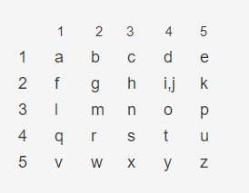
 其特点如下：
 （1）密文每两个数字被编做一组
 （2）所有数字均在1～5间浮动

这样，每个字母就对应了由两个数构成的字符α β，α是该字母所在行的标号，β是列
 标号。如c对应13，s对应43等。如果接收到密文为

43 15 13 45 42 15 32 15 43 43 11 22 15

则对应的明文即为secure message。

### 3.Nihilist 加密法

其步骤如下：

第一步，选取一个关键词已构成Polybius方格，即在5*5矩阵中填写关键词（去重），然后继续在其中按顺序填写字母表的其余字母。

第二步，选取的明文，利用以上的Polynius方格将其转换为数字（先行后列）。

### 4.Hill密码（希尔密码）

（1）加密：密文=明文*密钥矩阵 （注：明文要被分割成与密钥维数相同的一维行列式）
 *（2）解密：*明文=密文*密钥矩阵的逆 （注：要求与加密过程相同）

以下为案例：本人手写，如有不妥，请原谅(*´_ゝ｀)

加密：
 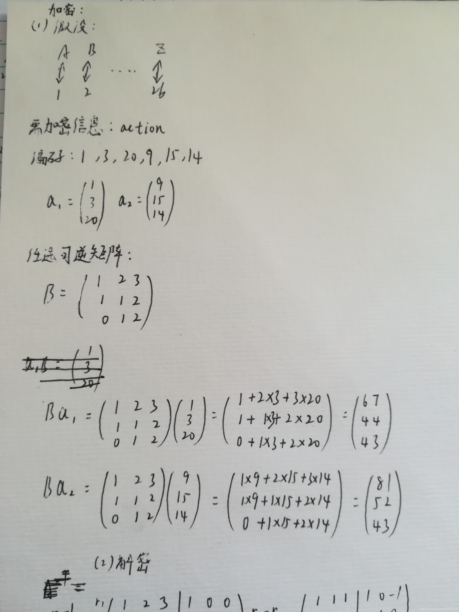
 解密：
 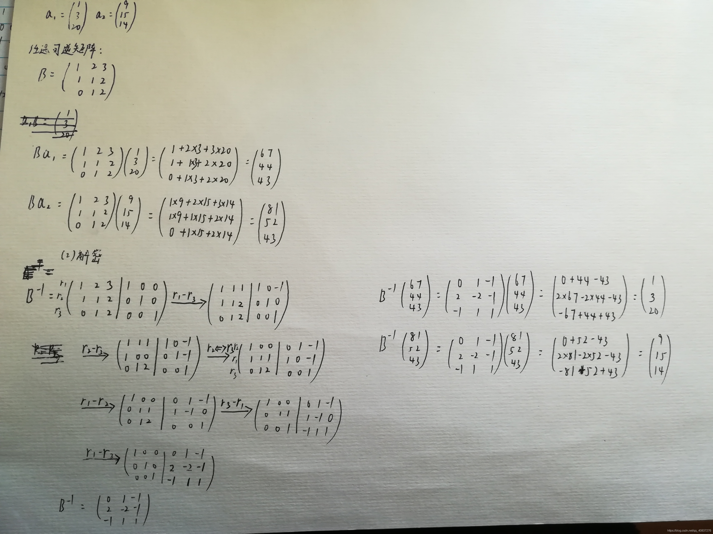

### 4.维吉尼亚密码

在凯撒密码基础上扩展出来的多表密码,引入了密钥,根据密钥来决定用哪一行的密表来进行替换.

假设明文对应行,秘钥对应列.我们举个简单的例子:
 明文: d
 秘钥: c
 在表中找到第d行,第c列,则
 密文:F

以此类推.

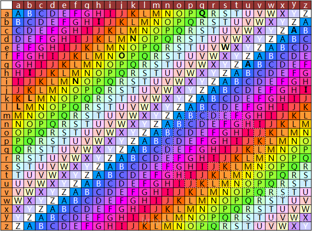

### Autokey Cipher(自动密钥密码)

自动密钥密码是密码学中的一种加密算法，与维吉尼亚密码类似，区别在于密钥不同。它的密钥开头是一个关键词，之后则是明文的重复。

示例

加密解密时使用的表格下面演示的是一种自动密钥密码的加密方法。先假设关键词为QUEENLY，而文本信息为ATTACK AT DAWN，则自动生成的密钥为"QUEENLYATTACKDAWN"。之后再通过维吉尼亚密码的表格法生成密文：

明文：ATTACK AT DAWN…
 密钥：QUEENL YA TTACK AT DAWN…
 密文：QNXEPV YT WTWP…

破译方法
 假设明文为MEET AT THE FOUNTAIN，关键词为KILT：

明文：MEETATTHEFOUNTAIN（未知）
 密钥：KILTMEETATTHEFOUN（未知）
 密文：WMPMMXXAEYHBRYOCA（已知）
 我们尝试一些常用单词、双字母组、三字母组等在密钥中的可能位置，如THE：

密文：WMP MMX XAE YHB RYO CA
 密钥：THE THE THE THE THE …
 明文：DFL TFT ETA FAX YRK …

密文：W MPM MXX AEY HBR YOC A
 密钥：. THE THE THE THE THE .
 明文：. TII TQT HXU OUN FHY .

密文：WM PMM XXA EYH BRY OCA
 密钥：… THE THE THE THE THE
 明文：… WFI EQW LRD IKU VVW
 我们将这些明文片段按出现的可能性排列：

不可能 <-------------------------->最可能
 EQW DFL TFT … … … … ETA OUN FAX
 由于正确的明文片段同样也会出现在密钥中，因此可以将其偏移关键词的长度而得到密钥片段。同样地，我们猜测的密钥片段THE也会出现在明文中。因此，猜测关键词的长度（譬如说3到12之间），我们就能得到明文和密钥。

尝试OUN可能得到：

偏移4位：
 密文：WMPMMXXAEYHBRYOCA
 密钥：…ETA.THE.OUN
 明文：…THE.OUN.AIN

偏移5位：
 密文：WMPMMXXAEYHBRYOCA
 密钥：…EQW…THE…OU
 明文：…THE…OUN…OG

偏移6位：
 密文：WMPMMXXAEYHBRYOCA
 密钥：…TQT…THE…O
 明文：…THE…OUN…M
 看起来偏移量为4时的可能性最大（其他的都含有不太可能出现的Q），因此我们再将新得到的ETA偏移4位：

密文：WMPMMXXAEYHBRYOCA
 密钥：…LTM.ETA.THE.OUN
 明文：…ETA.THE.OUN.AIN
 我们知道了关键词的长度很可能是4位（以LT结尾），且已有了文本的一部分：

M.ETA.THE.OUN.AIN
 之后以此为依据再进行一些猜测，可以验证如下是真正的明文：

MEETATTHEFOUNTAIN

### ADFGVX密码

ADFGVX密码是德军在第一次世界大战中使用的栏块密码。事实上，它是早先一种密码 ADFGX 的增补版。1918年3月Fritz  Nebel上校发明了这种密码，并提倡使用。它结合了改良过的Polybius方格替代密码与单行换位密码。这个密码以使用于密文当中六个字母 A,  D, F, G, V, X命名。ADFGVX 是被法国陆军中尉 Georges Painvin  所破解的。以古典密码学的标准来说，此密码破解的工作是属于格外困难的，在这期间，Painvin  更因此健康蒙受了严重损伤。他破解的方法是依靠于找到多份开头相同的讯息，这表示说它们是被相同的分解钥匙和移位钥匙加密的。

假设我们需要发送明文讯息 “Attack at once”， 用一套秘密混杂的字母表填满 Polybius 方格，像是这样:

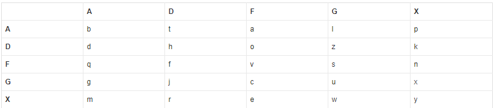

i 和 l 视为同个字，使字母数量符合 5 × 5  格。之所以选择这五个字母，是因为它们译成摩斯密码时不容易混淆，可以降低传输错误的机率。使用这个方格，找出明文字母在这个方格的位置，再以那个字母所在的栏名称和列名称代替这个字母。可将该讯息可以转换成处理过的分解形式。

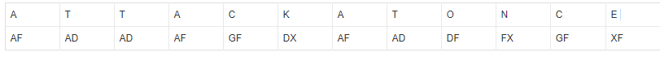

下一步，利用一个移位钥匙加密。假设钥匙字是"CARGO"，将之写在新格子的第一列。再将上一阶段的密码文一列一列写进新方格里。

C A R G O

------

A F A D A

D A F G F

D X A F A

D D F F X

G F X F X

最后，按照钥匙字字母顺序「ACGOR」依次抄下该字下整行讯息，形成新密文。如下:

FAXDF ADDDG DGFFF AFAXX AFAFX

在实际应用中，移位钥匙字通常有两打字符那么长，且分解钥匙和移位钥匙都是每天更换的。

ADFGVX

在 1918年 6月，再加入一个字 V 扩充。变成以 6 × 6 格共 36 个字符加密。这使得所有英文字母(不再将 I 和 J 视为同一个字)以及数字 0 到 9 都可混合使用。这次增改是因为以原来的加密法发送含有大量数字的简短信息有问题。

### 词频分析

[在线网站](https://quipqiup.com/)

## 其他（有些不知道归类到哪，就丢这里啦~）

### 1. Escape加密/UnEscape解密

JavaScript unescape() 函数可对通过 escape() 编码的字符串，找到形式为 %xx 和 %uxxxx 的字符序列(x 表示十六进制的数字)，用 Unicode 字符 \u00xx 和 \uxxxx 替换这样的字符序列进行解码。

例如: 世界你好
 加密后:%u4E16%u754C%u4F60%u597D

[在线解码](https://escape.supfree.net/)

### 2. eval(function(p,a,c,k,e,d)系列解密javascript程序

我也没弄懂这到底是什么东西,所以先贴为敬.

[解码链接](https://www.jb51.net/article/9705.htm)

### 3.VBScript

例如:
 \#@^TgAAAA==’[6*liLa6++p’aXvfiLaa6i[[avWi[[a*p[[6*!I’[6cp’aXvXILa6fp[:6+Wp[:XvWi[[6+XivRIAAA==^#@
 解密后:
 Encode@decode
 [在线解密](http://www.zhaoyuanma.com/aspdecode.php)

### 4.猪圈密码

以格子为基础的简单替代式密码，格子如下：
 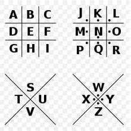
 若使用范例的关键字，则明文"X marks the spot"的加密结果将呈现如下:
 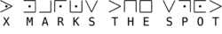

### 5.手机键盘加密

利用九键键盘进行加密，其特征为第一个字母不能为1，第二个字母不能超过4
 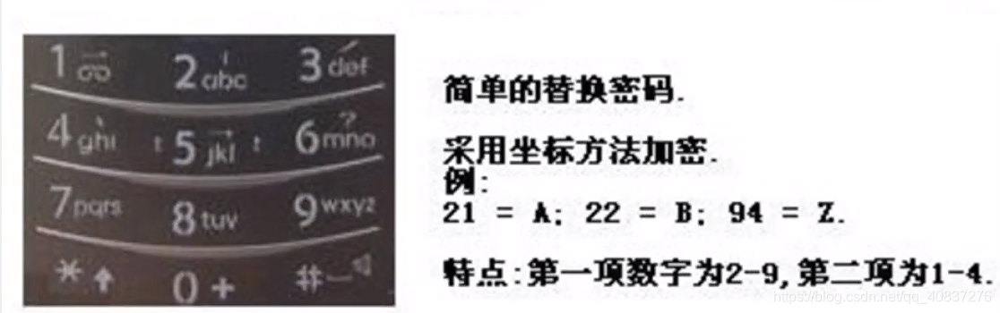

### 6.QWE密码

QWE密码 :指的是QWE格式键盘布局按 从左往右QWERTYUIOP ASDFGHJKL ZXCVBNM排列顺序一一对照英文字母表,如下:

QWE加密表:

┃a ┃b ┃c┃d ┃e ┃f ┃g ┃h┃i ┃ j┃k ┃l ┃m┃n┃o ┃p ┃q┃r┃s┃t ┃u ┃v┃w┃x ┃y ┃z ┃

┃Q┃W┃E┃R┃T ┃Y┃U┃I ┃O┃P┃A┃S┃D┃F┃G┃H┃J┃K┃L┃Z┃X┃C┃V┃B┃N┃M┃

QWE解密表:

┃A┃B┃C┃D┃E┃F┃G┃H┃I ┃J┃K┃L┃M┃N┃O┃P┃Q┃R┃S┃T┃U┃V┃W┃X┃Y┃Z┃

┃k ┃x┃v ┃m┃c┃n┃o ┃p┃h┃q┃r┃s ┃z ┃y ┃i ┃j ┃a ┃d┃l ┃e ┃g┃w┃b ┃u┃f ┃t ┃

### 7.曲路密码

是一种换位密码，需要事先双方约定密钥（曲路路径）。

明文：The quick brown fox jumps over the lazy dog
 填入5行7列表（事先约定好的行列数）
 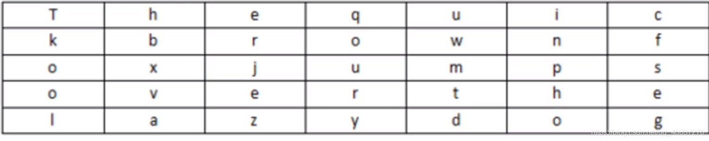
 加密的回路线（事先约定好的行列数）
 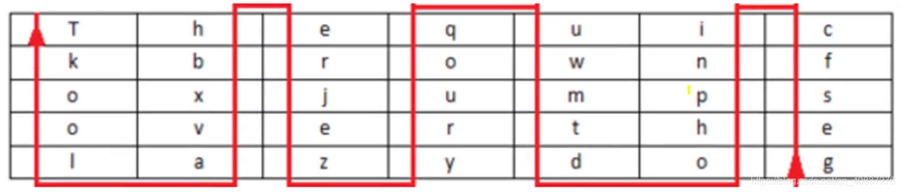
 密文：gesfc inpho dtmwu qoufy…

### 8.盲文

1.数字盲文
 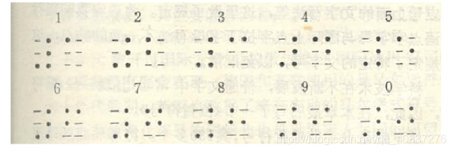
 2.字母盲文:
 

### 9.当铺密码

当铺密码 就是一种将中文和数字进行转化的密码，算法相当简单:当前汉字有多少笔画出头，就是转化成数字几。例如:

王夫 井工 夫口 由中人 井中 夫夫 由中大:67 84 70 123 82 77 125
 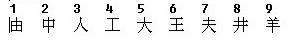

### 10.Brainfuck(BF)

Brainfuck，是一种极小化的计算机语言，它是由Urban Müller在1993年创建的。由于fuck在英语中是脏话，这种语言有时被称为brainf*ck或brainf***，甚至被简称为BF。
 
 [在线解密](http://tool.bugku.com/brainfuck/)

### 11.Ook!

Ook! 与Brainfuck类似, 但用单词“Ook！”，“Ook.” 和“Ook?”代替。
 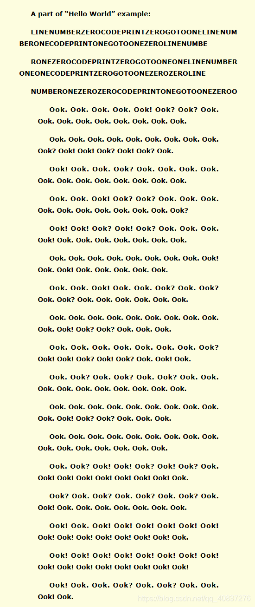
 [在线解密](http://tool.bugku.com/brainfuck/)

### 12.Piet

Piet是一种可视化的编程语言，其代码本身就是可视化的，像个位图。
 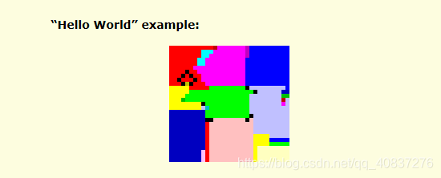

### [13种荒谬的编程语言](http://news.mydrivers.com/1/190/190926.htm)

### 摩斯电码

太有名了,没什么可补充的
 [在线解密](http://www.zhongguosou.com/zonghe/moErSiCodeConverter.aspx)

## 现代密码学——Hash

### MD5（哈希算法）

MD5即Message-Digest Algorithm  5(信息-摘要算法5)，用于确保信息传输完整一致。是计算机广泛使用的杂凑算法之一(又译摘要算法、哈希算法)，主流编程语言普遍已有MD5实现。将数据(如汉字)运算为另一固定长度值，是杂凑算法的基础原理，MD5的前身有MD2、MD3和MD4。

MD5算法具有以下特点:

1、压缩性:任意长度的数据，算出的MD5值长度都是固定的。对任意长度的明文均产生128位的消息摘要。

2、容易计算:从原数据计算出MD5值很容易。

3、抗修改性:对原数据进行任何改动，哪怕只修改1个字节，所得到的MD5值都有很大区别。

4、强抗碰撞:已知原数据和其MD5值，想找到一个具有相同MD5值的数据(即伪造数据)是非常困难的。

特征：（1）长度固定
 （2）只可能小写和数字

例： 123456
 MD5 e10adc3949ba59abbe56e057f20f883e
 [具体算法过程，表示没大看懂，在此不做赘述](https://blog.csdn.net/u012611878/article/details/54000607)

MD5里的salt值:
 在密码学中，是指通过在密码任意固定位置插入特定的字符串，让散列后的结果和使用原始密码的散列结果不相符，这种过程称之为“加盐”。

例如:

MD5(‘123’ + ‘1ck12b13k1jmjxrg1h0129h2lj’) = ‘6c22ef52be70e11b6f3bcf0f672c96ce’
 MD5(‘456’ + ‘1h029kh2lj11jmjxrg13k1c12b’) = ‘7128f587d88d6686974d6ef57c193628’

[在线解密](https://www.cmd5.com/)

## 现代密码学——非对称密码体系

### 1.RSA

RSA公钥加密算法是1977年由罗纳德·李维斯特(Ron Rivest)、阿迪·萨莫尔(Adi  Shamir)和伦纳德·阿德曼(Leonard  Adleman)一起提出的。1987年7月首次在美国公布，当时他们三人都在麻省理工学院工作实习。RSA就是他们三人姓氏开头字母拼在一起组成的。

RSA是目前最有影响力和最常用的公钥加密算法，它能够抵抗到目前为止已知的绝大多数密码攻击，已被ISO推荐为公钥数据加密标准。

今天只有短的RSA钥匙才可能被强力方式解破。到2008年为止，世界上还没有任何可靠的攻击RSA算法的方式。只要其钥匙的长度足够长，用RSA加密的信息实际上是不能被解破的。目前普遍认为，***模式n至少应该取1024位，最好是2048位。***但在分布式计算和量子计算机理论日趋成熟的今天，RSA加密安全性受到了挑战和质疑。

RSA算法基于一个十分简单的数论事实:将两个大质数相乘十分容易，但是想要对其乘积进行因式分解却极其困难，因此可以将乘积公开作为加密密钥。

甲方发送数据给乙方。
 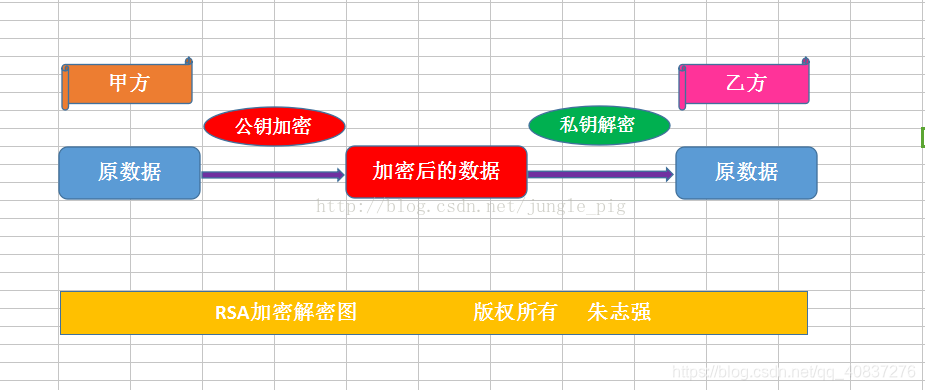
 已方发送数据给甲方。
 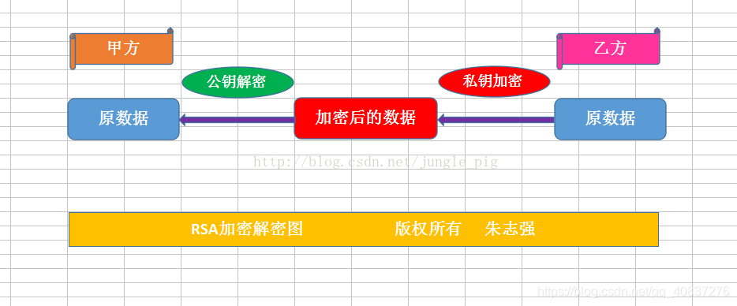
 RSA算法举例：
 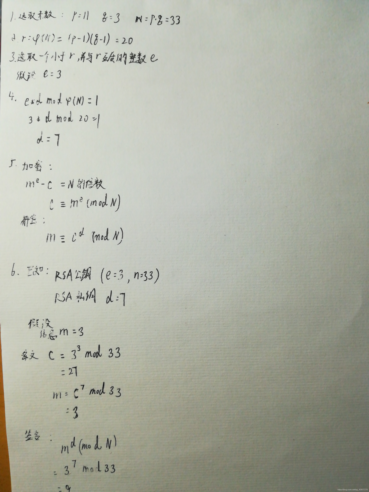

常用解密工具：
 RSAtool
 链接：https://pan.baidu.com/s/19DgBYhnWyN3tYTm55uXfqQ
 提取码：dt1k
 复制这段内容后打开百度网盘手机App，操作更方便哦

[RSA公钥在线加密解密](http://tool.chacuo.net/cryptrsapubkey)
 [RSA私钥在线加密解密](http://tool.chacuo.net/cryptrsaprikey)

### 2.DSA（Digital Signature Algorithm）

DSA是Schnorr和ElGamal签名算法的变种，被美国NIST作为DSfS(DigitalSignature  Standard)。它是一种公开密钥算法，不能用作加密，只用作数字签名。DSA使用公开密钥，为接受者验证数据的完整性和数据发送者的身份。它也可用于由第三方去确定签名和所签数据的真实性。
 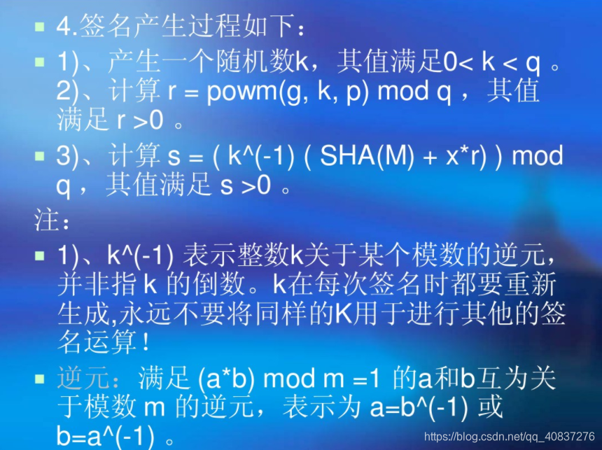
 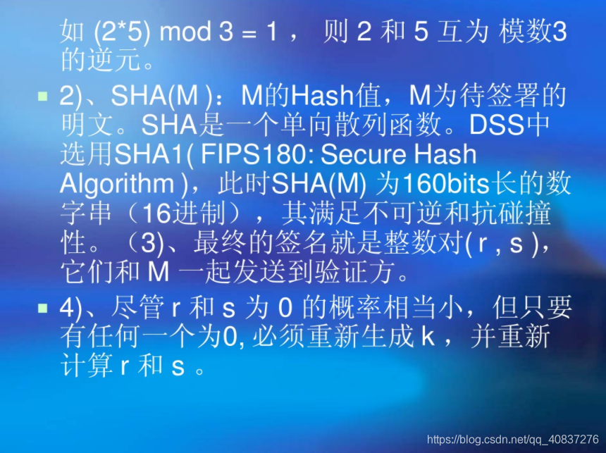
 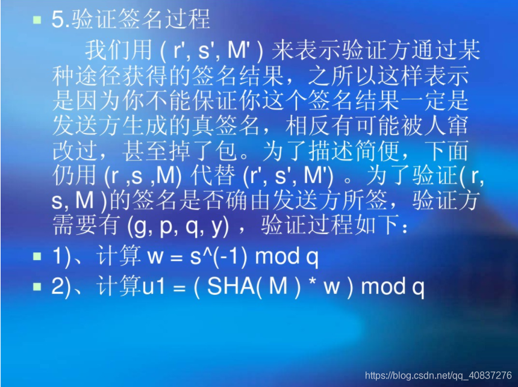
 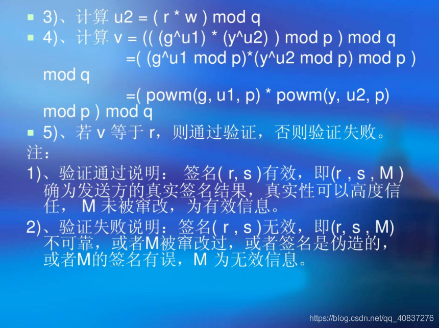
 DSA依赖于整数有限域离散对数难题。素数p必须足够大，且p-1至少包含一个大素数因子以抵抗 Pohlig  &Hellman算法的攻击。M一般都应采用消息的HASH值。DSA的安全性主要依赖于p和g，若选取不当则签名容易伪造，应保证g对于p-1的大素数因子不可约。DSA的一个重要特点是两个素数公开，这样，当使用别人的p和q时，即使不知道私钥，你也能确认它们是否是随机产生。

DSA辅助工具：
 链接：https://pan.baidu.com/s/10SIwLY-csyQOZNpr8FWF0g
 提取码：t5xr
 复制这段内容后打开百度网盘手机App，操作更方便哦

### ECC（Elliptic Curves Cryptography，椭圆曲线密码编码学）

椭圆加密算法(ECC)是一种公钥加密体制，最初由Koblitz和Miller两人于1985年提出，其数学基础是利用椭圆曲线上的有理点构成Abel加法群上椭圆离散对数的计算困难性。公钥密码体制根据其所依据的难题一般分为三类:大整数分解问题类、离散对数问题类、椭圆曲线类。有时也把椭圆曲线类归为离散对数类。
 [ECC加密算法详解，看不懂。。。。](https://www.pediy.com/kssd/pediy06/pediy6014.htm)
 ECC辅助解密工具：
 链接：https://pan.baidu.com/s/1C70ig18FLEEqphCldnDqbg
 提取码：1twt
 复制这段内容后打开百度网盘手机App，操作更方便哦

### serpent(蛇)加密/解密

原理没看懂,贴博客:
 [添加链接描述](https://blog.csdn.net/douqingl/article/details/50256931)
 [在线解密:](http://serpent.online-domain-tools.com/)

## 现代密码学——对称密码体系

对称加密又分为分组加密和序列密码。
 分组密码，也叫块加密(block cyphers)，一次加密明文中的一个块。是将明文按一定的位长分组，明文组经过加密运算得到密文组，密文组经过解密运算（加密运算的逆运算），还原成明文组。
 序列密码，也叫流加密(stream cyphers)，一次加密明文中的一个位。是指利用少量的密钥（制乱元素）通过某种复杂的运算（密码算法）产生大量的伪随机位流，用于对明文位流的加密。
 解密是指用同样的密钥和密码算法及与加密相同的伪随机位流，用以还原明文位流。

分组加密算法中，有ECB,CBC,CFB,OFB这几种加密模式。

### AES（Advanced Encryption Standard）

在密码学中又称Rijndael加密法，是美国联邦政府采用的一种区块加密标准。这个标准用来替代原先的DES，已经被多方分析且广为全世界所使用。经过五年的甄选流程，高级加密标准由美国国家标准与技术研究院(NIST)于2001年11月26日发布于FIPS PUB 197，并在2002年5月26日成为有效的标准。2006年，高级加密标准已然成为对称密钥加密中最流行的算法之一。

aes密文包括字母 数字 + = /等
 [AES详解](https://www.cnblogs.com/block2016/p/5596676.html)
 [AES在线加密解密](http://tool.oschina.net/encrypt/)

### 1.CBC(Cipher Block Chaining)/密文分组链接方式

DES CBC（密文分组链接方式）有点麻烦，它的实现机制使加密的各段数据之间有了联系。其实现的机理如下：

加密步骤如下：

（1）首先将数据按照8个字节一组进行分组得到D1D2…Dn（若数据不是8的整数倍，用指定的PADDING数据补位）

（2）第一组数据D1与初始化向量I异或后的结果进行DES加密得到第一组密文C1（初始化向量I为全零）

（3）第二组数据D2与第一组的加密结果C1异或以后的结果进行DES加密，得到第二组密文C2

（4）之后的数据以此类推，得到Cn

（5）按顺序连为C1C2C3…Cn即为加密结果。
 解密是加密的逆过程，步骤如下：

1）首先将数据按照8个字节一组进行分组得到C1C2C3…Cn

2）将第一组数据进行解密后与初始化向量I进行异或得到第一组明文D1（注意：一定是先解密再异或）

3）将第二组数据C2进行解密后与第一组密文数据进行异或得到第二组数据D2

4）之后依此类推，得到Dn

5）按顺序连为D1D2D3…Dn即为解密结果。

这里注意一点，解密的结果并不一定是我们原来的加密数据，可能还含有你补得位，一定要把补位去掉才是你的原来的数据。

特点：

1. 不容易主动攻击,安全性好于ECB,适合传输长度长的报文,是SSL、IPSec的标准。
    each ciphertext block depends on all message blocks/每个密文块依赖于所有的信息块
    thus a change in the message affects all ciphertext blocks/明文消息中一个改变会影响所有密文块
2. need Initial Vector (IV) known to sender & receiver/发送方和接收方都需要知道初始化向量
    3.加密过程是串行的，无法被并行化(在解密时，从两个邻接的密文块中即可得到一个平文块。因此，解密过程可以被并行化)。

### 2.CFB（Cipher Feedback）/ 密文反馈模式

密文反馈模式类似于CBC，可以将块密码变为自同步的流密码；工作过程亦非常相似，CFB的解密过程几乎就是颠倒的CBC的加密过程：
  需要使用一个与块的大小相同的移位寄存器，并用IV将寄存器初始化。然后，将寄存器内容使用块密码加密，然后将结果的最高x位与平文的x进行异或，以产生密文的x位。下一步将生成的x位密文移入寄存器中，并对下面的x位平文重复这一过程。解密过程与加密过程相似，以IV开始，对寄存器加密，将结果的高x与密文异或，产生x位平文，再将密文的下面x位移入寄存器。
 与CBC相似，平文的改变会影响接下来所有的密文，因此加密过程不能并行化；而同样的，与CBC类似，解密过程是可以并行化的。

### 3.ECB(Electronic Code Book)/电码本模式

DES ECB（电子密本方式）其实非常简单，就是将数据按照8个字节一段进行DES加密或解密得到一段8个字节的密文或者明文，最后一段不足8个字节，按照需求补足8个字节进行计算，之后按照顺序将计算所得的数据连在一起即可，各段数据之间互不影响。

特点：

1.简单，有利于并行计算，误差不会被传送；
 2.不能隐藏明文的模式；
 repetitions in message may show in cipher text/在密文中出现明文消息的重复
 3.可能对明文进行主动攻击；
 加密消息块相互独立成为被攻击的弱点/weakness due to encrypted message blocks being independent

### 4.OFB (Output Feedback)/输出反馈模式

输出反馈模式可以将块密码变成同步的流密码。它产生密钥流的块，然后将其与平文块进行异或，得到密文。与其它流密码一样，密文中一个位的翻转会使平文中同样位置的位也产生翻转。这种特性使得许多错误校正码，例如奇偶校验位，即使在加密前计算而在加密后进行校验也可以得出正确结果。
 每个使用OFB的输出块与其前面所有的输出块相关，因此不能并行化处理。然而，由于平文和密文只在最终的异或过程中使用，因此可以事先对IV进行加密，最后并行的将平文或密文进行并行的异或处理。
 可以利用输入全0的CBC模式产生OFB模式的密钥流。这种方法十分实用，因为可以利用快速的CBC[硬件](https://marketing.csdn.net/p/3127db09a98e0723b83b2914d9256174?pId=2782&utm_source=glcblog&spm=1001.2101.3001.7020)实现来加速OFB模式的加密过程。

### DES

DES算法为密码体制中的对称密码体制，又被称为美国数据加密标准，是1972年美国IBM公司研制的对称密码体制加密算法。  明文按64位进行分组，密钥长64位，密钥事实上是56位参与DES运算（第8、16、24、32、40、48、56、64位是校验位，  使得每个密钥都有奇数个1）分组后的明文组和56位的密钥按位替代或交换的方法形成密文组的加密方法。
 [视频详解（力推，非常清晰）](https://www.bilibili.com/video/av18027475?from=search&seid=15232889085583858983)
 [文字详解](https://blog.csdn.net/qq_27570955/article/details/52442092)
 [DES在线解密](http://tool.chacuo.net/cryptdes)
 [DES在线解密](http://encode.chahuo.com/)

### TEA（Tiny Encryption Algorithm）

TEA算法由剑桥大学计算机实验室的David Wheeler和Roger  Needham于1994年发明。它是一种分组密码算法，其明文密文块为64比特，密钥长度为128比特。TEA算法利用不断增加的Delta(黄金分割率)值作为变化，使得每轮的加密是不同，该加密算法的迭代次数可以改变，建议的迭代次数为32轮。
 [TEA加密算法详解](https://jingyan.baidu.com/article/b2c186c829035dc46ef6ffd7.html)

### RC4/5

[RC4算法详解](https://wenku.baidu.com/view/404a49828762caaedd33d4c2.html)
 [RC5算法详解](https://wenku.baidu.com/view/83c44d0876c66137ee06193b.html)

特此声明：以上摘自 CSDN、博客园、简书、微博、百度百科等。