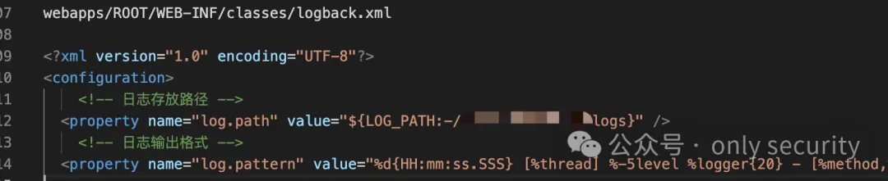

# 若依前后端分离下的渗透测试

原创 f0ng [only security](javascript:void(0);) *2024年02月01日 22:25* *江苏*


前阵子做了个若依后端接口，没有前端页面，之前遇到过很多次，但是都一笔带过没有怎么仔细地看，这次因为是单个系统，所以不得不仔细看一遍，这里做个记录，方便以后进行测试

# **0x00 概述**

对若依后端的测试，通过搭建前端结合后端进行测试，并对Tomcat部署的若依系统进行任意文件读取的深入利用，比较琐碎，对测试记录进行一个分享

# **0x01 背景**

目标打开就是这样，后来经过询问，发现是通过小程序登录，调用的api是这个域名下的


# **0x02 通过小程序获得漏洞入场券**

通过对小程序的渗透，得到了一个token，也就是认证用的jwt，通过对用户的操作，修改了用户的权限，提升到了管理员权限

【这里数据包是内网的，因为在本地搭建了前端页面，导致请求的host都是本地的环境，实际上后端请求的都是目标站点的，后面会提到】

```
PUT /dev-api/system/user HTTP/1.1
Host: 192.168.0.105:1024
Accept-Encoding: gzip, deflate
Accept: application/json, text/plain, */*
Accept-Language: zh-CN,zh;q=0.8,zh-TW;q=0.7,zh-HK;q=0.5,en-US;q=0.3,en;q=0.2
Content-Type: application/json;charset=utf-8
Authorization: Bearer xxxx
Origin: http://192.168.0.105:1024
Sec-GPC: 1
Referer: http://192.168.0.105:1024/system/user
Cookie: Admin-Token=xxxx
User-Agent: Mozilla/5.0 (Macintosh; Intel Mac OS X 10.15; rv:121.0) Gecko/20100101 Firefox/121.0
Content-Length: 760

{"createBy":"admin","createTime":"2024-01-04 11:32:44","updateBy":null,"updateTime":null,"remark":null,"userId":101,"deptId":null,"userName":"test141414","nickName":"test141414","email":"123456@qq.com","phonenumber":"18812341234","sex":"0","avatar":"","password":"","status":"0","delFlag":"0","loginIp":"''''","loginDate":"2024-01-04T11:35:24.000+08:00","dept":null,"roles":[],"roleIds":[1],"postIds":[],"roleId":null,"admin":true}
```


1为管理员角色(实际上，还有一些其他操作，这里不再赘述)

后面对一些api的请求也是可以直接操作了，比如定时任务、在线用户等等之类


但是只有一个api接口，没有前端，让笔者感觉操作起来不方便，因为我们知道，若依的话是有个后台管理系统的ui的，这里只有接口，所以就在想有没有可能在本地搭建一个前端【或者公网找一个若依前端】，加载目标的接口

# **0x03 搭建前端**

后面也是去翻了下若依分离版本，本地搭建了一下【其实也可以在公网找一个若依前端去加载目标接口】，发现可以本地直接搭建一个前端，去加载目标的api

于是，本地直接搭建了一个ruoyi-vue版本的，将`ruoyi-ui`文件夹单独拎出来，修改了`vue.config.js`里的`target`参数，直接修改为域名地址，即可


在`ruoyi-ui`文件夹中执行`npm run dev`


访问本地地址，就会出现这样的页面


# **0x04 通过前后端结合测试**

这里进去有两个思路

1. 通过之前小程序获取到的token，替换直接进


1. 也可以通过之前接口获取到的用户名，直接用`123456`、`admin123`等弱密码进入系统


这里比较有趣的就是用户名，用的是小程序的标识作为用户名，o开头的那种字段，28位，只有通过小程序的接口才能获取到

进入系统就是相当于在本地测试了【这里不知道是不是BUG，通过本地搭建的，若依后台接口获取到的IP也是内网的，不是公网IP】


后面也是发现了一些若依后台漏洞，比如文件读取


想找到配置文件，配置文件可能有aksk、jdbc、redis等等，若依的redis一般都是4.x 5.x，有主从复制


这里通过`/proc/self/cmdline`拿到的内容如上

通过看到的内容，可以判断这是一个用Tomcat部署的Ruoyi前后端分离的项目

写了个代码爆破了很久


通过字典`https://github.com/f0ng/JavaFileDict`也只爆破出来了几个路径


基本都是ruoyi的默认路径，想进一步爆破，没有任何思路，爆破了得有一万次


# **0x05 本地搭建环境获取配置文件**

最后在本地搭建了一遍若依之后，想到了，有logback.xml，那么就去读日志



找到了jar包，下载


但是没找到配置文件

于是根据命名规则，下载了其他的jar包，如下


唯独最重要包含配置文件的`admin` jar包没找到，很烦躁，一度放弃

这里又浪费了很多时间

再转念一想，看了部署的路径`/home/xxxxuser/tomcatxxxx`， 之前的任意文件读取，读不了`/etc/shadow`、`/root/.bash_history`等等，那么他现在这个`xxxxuser`是不是有`.bash_history`呢，尝试读了一下，发现真有


随后就找到了war包


wc，真的悔恨，一直没有爆破`ROOT.war`这个文件，下载以后，发现解压有问题，原因在于首行返回了2000干扰了


这里用的yakit来替换2000为空，就可以正常解压了，解压以后发现，他这个文件命名。。。。 PS:已经同步更新到 `https://github.com/f0ng/JavaFileDict`


期间问了很多xcx师傅的，最后

好吧，是开发大佬太专业。。。

拿到ak、sk，完结


# **0x06 总结**

1. 前后端分离的站点并非没有漏洞，实际上还是有漏洞的，关键点在于对这个框架的了解程度，以及有没有去深入利用漏洞，比如这里获得了漏洞的入场券进入后台，最后读到了ak、sk
2. 对中间件还是要敏感一点，如本文中一开始通过`cmdline`获取到了是Tomcat部署的这个信息，那么一开始就要想到读取`ROOT.war`，而不是思维定式一直去读取jar
3. 漏洞的利用门槛越来越高，对白帽的能力要求也越来越高。随着前后端框架诞生，对一些前后端框架的了解不深，导致没有对这种漏洞进行很好的认知，后续还是要加强这方面的开发知识，才能更好地渗透

# **0x07 引用**

> https://blog.csdn.net/qq_33525062/article/details/132164657   若依前后端分离搭建
>
> https://blog.csdn.net/qq_41607217/article/details/118904019   若依前后端分离搭建
>
> https://blog.csdn.net/Share_Li_98/article/details/126527874   若依框架-接口汇总
>
> https://doc.ruoyi.vip/ruoyi/document/htsc.html   若依官方文档
>
> https://github.com/f0ng/JavaFileDict   Java应用文件字典