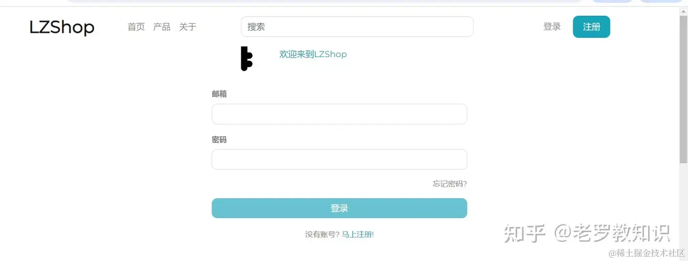

# [[附源码\]springboot线上商城源码|前后端分离|界面超简洁](https://segmentfault.com/a/1190000045026063)

[**精品源码屋**](https://segmentfault.com/u/luoji_5fd04c0779e7c)[7 月 2 日 湖南](https://segmentfault.com/a/1190000045026063/revision)

阅读 8 分钟

## 一. 前言

今天小编给大家
带来了一款可学习，可商用的商城售卖的网站源码，支持二开，无加密。代码的后端是SpringBoot技术栈（非jsp），前端是Angular。如果您需要定制需求请找小编。
文章第六小节会贴上优秀代码案例。可以确认是不是主流编码风格。

## 二. 视频演示

网站的截图在文章末尾给出，这里先给出我演示的网站视频：

[https://githubs.xyz/show/191.mp4](https://link.segmentfault.com/?enc=SpZZYJav0eKchwAz9kZRxA%3D%3D.no4dEotk21QcGyeMP83QFIeC0CvpREHBvJnHmhxaQNe0bnJ8zTtwrYKC4PPHay7C)


## 三. 技术栈以及问题

后端技术栈:

JDK11
SpringBoot2.3.3+Hibernate
OAuth2
MySQL8
Maven
Spring Cache本地缓存
RestFull API
Swagger

前端技术栈：

Angular 10
Rxjs
Ngrx Store
Bootstrap
NgBootstrap
FontAwesome

**当前问题**

没有实现管理后台。（找我可以帮您实现）
支付是模拟的，并没有对接支付。（根据您的需求对接）
只支持PC端，不支持移动设备。

如果您需要定制修改源码，请联系小编。

源码git：
`https://gitee.com/hadluo/lzshop.git`

## 四. 后端搭建

#### 1. 数据库创建

创建一个数据库为 lzshop 的数据库。
脚本位置在 sql/lzshop.sql， 我们直接导入脚本:


#### 2. 代码搭建

后端代码分为两块服务：

authorization_server（权限服务）
resource_server （主要业务逻辑实现服务）


authorization_server搭建

用idea导入authorization_server服务，找到yml配置，修改成你的数据库地址和账号密码：

```bash
    ## 修改成你的数据库信息
    url: jdbc:mysql://localhost:3306/lzshop?useSSL=false&useUnicode=yes&characterEncoding=UTF-8&allowPublicKeyRetrieval=true&serverTimezone=UTC
    username: root
    password: 123456
```

然后找到 OauthApplication 启动类启动


resource_server搭建

用 idea导入resource_server 服务，找到yml配置，修改成你的数据库地址和账号密码：

```bash
    ## 修改成你的数据库信息
    url: jdbc:mysql://localhost:3306/lzshop?useSSL=false&useUnicode=yes&characterEncoding=UTF-8&allowPublicKeyRetrieval=true&serverTimezone=UTC
    username: root
    password: 123456
```

然后找到 BackendApplication启动类启动

## 五. 前端搭建

前端代码在client下面


前端是angular项目，部署教程专门搞了一篇教程部署：

```
https://zhuanlan.zhihu.com/p/706421837
```

运行结果：


## 六. 后端技术集锦

后端采用了当前主流的技术和经典代码，毕竟优秀的代码维护起来都是相当解耦和容易的，bug也是微乎其微。这里我找几个重点代码讲解。

**代码1：自定义检验注解**

```typescript
// ***********************某个request的请求参数******************    
    @NotBlank
    @Size(min = 3, max = 52)
    @CustomEmail   //自定义的邮件校验注解
    private String email;

// ***********************邮件校验注解******************
@Target({TYPE, FIELD, ANNOTATION_TYPE})
@Retention(RUNTIME)
@Constraint(validatedBy = CustomEmailValidator.class)
@Documented
public @interface CustomEmail {
    String message() default "Invalid email";
    Class<?>[] groups() default {};
    Class<? extends Payload>[] payload() default {};
}
// ***********************具体邮件校验实现******************
public class CustomEmailValidator implements ConstraintValidator<CustomEmail, String> {
    private static final String EMAIL_PATTERN = "^[a-zA-Z0-9_!#$%&’*+/=?`{|}~^.-]+@[a-zA-Z0-9.-]+$";
    private Pattern pattern;
    private Matcher matcher;
    @Override
    public boolean isValid(String email, ConstraintValidatorContext context) {
        return (validateEmail(email));
    }
    private boolean validateEmail(String email) {
        pattern = Pattern.compile(EMAIL_PATTERN);
        matcher = pattern.matcher(email);
        return matcher.matches();
    }
}
```

**代码2：转换层（数据库实体转前端返回实体）**

```reasonml
// ***********************一个查询用户业务实现****************** 
public UserResponse fetchUser() {
        String userName = SecurityContextHolder.getContext().getAuthentication().getName();
        if (Objects.isNull(userName)) {
            throw new AccessDeniedException("Invalid access");
        }
        Optional<User> user = userRepository.findByEmail(userName);
        if (user.isEmpty()) {
            throw new ResourceNotFoundException("User not found");
        }
       // ***********************利用用户转换器进行转换****************** 
        return userResponseConverter.apply(user.get());
    }
 // ***********************用户转换器****************** 
@Component
public class UserResponseConverter implements Function<User, UserResponse> {
    @Override
    public UserResponse apply(User user) {
       // 设置该返回的值
        UserResponse userResponse = new UserResponse();
        userResponse.setEmail(user.getEmail());
        userResponse.setFirstName(user.getFirstName());
        userResponse.setLastName(user.getLastName());
        userResponse.setAddress(user.getAddress());
        userResponse.setCity(user.getCity());
        userResponse.setState(user.getState());
        userResponse.setZip(user.getZip());
        userResponse.setPhone(user.getPhone());
        userResponse.setCountry(user.getCountry());
        userResponse.setEmailVerified(user.getEmailVerified());
        return userResponse;
    }
}
```

**代码3：Spring事件ApplicationListener**

```reasonml
// ***********************忘记密码，发送邮件****************** 
@Component
public class PasswordForgotListener implements ApplicationListener<OnPasswordForgotRequestEvent> {

    @Autowired
    private JavaMailSender mailSender;
    @Autowired
    private MailConstants mailConstants;
    @Override
    public void onApplicationEvent(OnPasswordForgotRequestEvent event) {
        this.confirmRegistration(event);
    }
    private void confirmRegistration(OnPasswordForgotRequestEvent event) {
        String recipientAddress = event.getUser().getEmail();
        String subject = "\uD83D\uDD11 密码重置确认";
        String confirmationUrl = mailConstants.getHostAddress() + "/passwordResetConfirm?token=" + event.getToken();
        String message = "Hi ,\n\n请点击下面链接重置密码。";
        SimpleMailMessage email = new SimpleMailMessage();
        email.setTo(recipientAddress);
        email.setSubject(subject);
        email.setText(message + "\n\n" + confirmationUrl + "\n\n\nw/ Keyist Team");
        mailSender.send(email);
    }
}
```

**代码4：Spring本地缓存 @Cacheable注解**

```reasonml
// ***********************查询关联商品的逻辑****************** 
    @Cacheable(key = "{#productCategory.name,#id}", unless = "#result.size()==0")
    public List<Product> getRelatedProducts(ProductCategory productCategory, Long id) {
        List<Product> productList = productRepository.findTop8ByProductCategoryAndIdIsNot(productCategory, id);
        if (productList.size() < 8) {
            productList.addAll(productRepository.findAllByProductCategoryIsNot(productCategory, PageRequest.of(0, 8 - productList.size())));
        }
        return productList;
    }
```

**代码5：严格的restful api 风格**


**代码6：数据库层，没有任何sql和xml**

```mathematica
@Repository 
public interface ProductRepository extends PagingAndSortingRepository<Product, Long> {
    Optional<Product> findByUrl(String url);

    List<Product> findAllByProductCategory(Pageable pageable, ProductCategory productCategory);

    List<Product> findTop8ByOrderByDateCreatedDesc();

    List<Product> findAllByNameContainingIgnoreCase(String name, Pageable pageable);

    List<Product> findTop8ByProductCategoryAndIdIsNot(ProductCategory productCategory, Long id);

    List<Product> findAllByProductCategoryIsNot(ProductCategory productCategory, Pageable pageable);
}
```

**swagger文档**


还有很多很多，我就不贴了，优秀的代码维护起来都是相当容易的，bug也是微乎其微。

## 七. 演示截图

首页


产品页


搜索页


商品详情


登录



购物车


购物车结算


确认支付


支付完成


订单列表


收货地址


用户信息


## 结尾语

我是分享好物+教程+源码的老罗，欢迎关注，后续会有更精彩的源码分享！

[springboot](https://segmentfault.com/t/springboot)