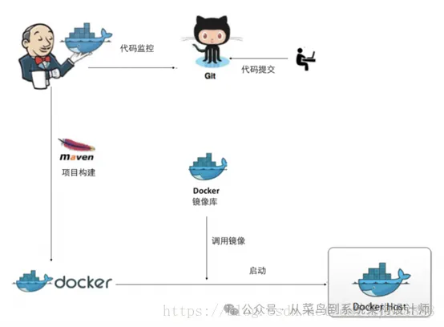
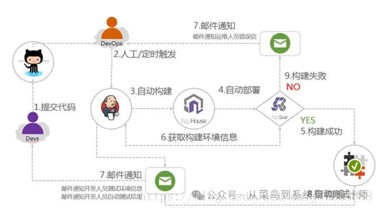
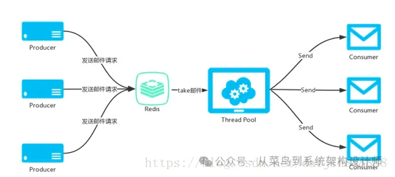

# WEB架构设计

从菜鸟到架构师 [从菜鸟到系统架构设计师](javascript:void(0);) *2024年04月17日 10:49* *广东*

## 一、架构演变：

   （1）初始搭建：基于框架，运行在Tomcat容器中，文件、数据库、应用程序在一个服务器上。

   （2）服务分离：随着用户量上升，单台服务器无法满足系统的负载，可以把应用服务器和数据服务器单独部署，如果有条件也可以把文件服务器单独部署。

   （3）反向代理： 为了提升服务处理能力，我们在Tomcat容器前加一个代理服务器如Nginx、apache也。用户的请求发送给反向代理，然后反向代理把请求转发到后端的服务器。严格意义上来说，Nginx属于web服务器，一般处理静态html、css、js请求，而Tomcat属于web容器，专门处理JSP请求，当然Tomcat也是支持html的，只是效果没有Nginx好而已。

  （4）动静分离：基于以上Nginx反向代理，我们还可以实现 动静分离，静态请求如html、css、js等请求交给Nginx处理，动态请求分发给后端Tomcat处理。Nginx 升级到1.9.5+可以开启HTTP/2.0时代，加速网站访问。当然，如果公司不差钱， CDN也是一个不错的选择。

   （5）服务拆分： 在这分布式微服务已经普遍流行的年代，其实我们没必要踩过多的坑，就很容易进行拆分。市面上已经有相对比较成熟的技术，比如阿里开源的Dubbo(官方明确表示已经开始维护了)，Spring家族的SpringCloud，当然具体如何去实施，无论是技术还是业务方面都要有很好的把控。

​    **Dubbo：**Dubbo是一个分布式服务框架，致力于提供高性能和透明化的RPC远程服务调用方案，以及SOA服务治理方案。简单的说，dubbo就是个服务框架，如果没有分布式的需求，其实是不需要用的，只有在分布式的时候，才有dubbo这样的分布式服务框架的需求，并且本质上是个服务调用的东东，说白了就是个远程服务调用的分布式框架（告别Web Service模式中的WSdl，以服务者与消费者的方式在dubbo上注册）
其核心部分包含:

   **SpringCloud:**服务发现——Netflix Eureka;客服端负载均衡——Netflix Ribbon;断路器——Netflix Hystrix;服务网关——Netflix Zuul

分布式配置——Spring Cloud Config.

  **微服务与轻量级通信:**同步通信和异步通信;远程调用RPC;REST;消息队列

###  **(6)持续集成部署**

​    服务拆分以后，随着而来的就是持续集成部署，你可能会用到以下工具：Docker、Jenkins、Git、Maven。基本拓扑结构如下所示：

整个持续集成平台架构演进到如下图所示：

   **(7)服务集群:** Linux集群主要分成三大类( 高可用集群， 负载均衡集群，科学计算集群)。其实，我们最常见的也是生产中最常接触到的就是负载均衡集群。

   **负载均衡实现:**DNS负载均衡，一般域名注册商的dns服务器不支持，但博主用的阿里云解析已经支持,四层负载均衡(F5、LVS)，工作在TCP协议下,七层负载均衡(Nginx、haproxy)，工作在Http协议下

   **分布式session:**服务一般分为有状态和无状态，而分布式sessoion就是针对有状态的服务。

   **(8)读写分离:**MySql主从配置，读写分离并引入中间件，开源的MyCat，阿里的DRDS都是不错的选择。如果是对高可用要求比较高，但是又没有相应的技术保障，建议使用阿里云的RDS或者Redis相关数据库，省事省力又省钱。

   **(9)缓存优化:** 引入缓存无非是为了减轻后端数据库服务的压力，防止其"罢工"。常见的缓存服务有，Ehcache、OsCache、MemCache、Redis，当然这些都是主流经得起考验的缓存技术实现，特别是Redis已大规模运用于分布式集群服务中，并证明了自己优越的性能。

  **(10)消息队列** 异步通知：比如短信验证，邮件验证这些非实时反馈性的逻辑操作。

   **流量削锋：**应该是消息队列中的常用场景，一般在秒杀或团抢活动中使用广泛。

   **日志处理：**系统中日志是必不可少的，但是如何去处理高并发下的日志确是一个技术活，一不小心可能会压垮整个服务。工作中我们常用到的开源日志ELK，为嘛中间会加一个Kafka或者redis就是这么一个道理(一群人涌入和排队进的区别)。

   **消息通讯：**点对点通信(个人对个人)或发布订阅模式(聊天室)。

   **(11)日志服务:**消息队列中提到的ELK开源日志组件对于中小型创业供公司是一个不错的选择。

   **(12)安全优化：** 以上种种，没有安全做保证可能都会归于零。

   阿里云的VPN虚拟专有网络以及安全组配置自建机房的话，要自行配置防火墙安全策略相关服务访问，比如Mysql、Redis、Solr等如果没有特殊需求尽量使用内网访问并设置鉴权尽量使用代理服务器，不要对外开放过多的端口https配合HTTP/2.0也是个不错的选择

**二、必备工具**

1、操作系统

  Linux（必备）、微软

2、负载均衡

  DNS、F5、LVS、Nginx、OpenResty、HAproxy、负载均衡SLB（阿里云）

3、分布式框架

  Dubbo、Motan、Spring-Could

4、数据库中间件

  DRDS （阿里云）、Mycat、360Atlas、Cobar (不维护了)

5、消息队列

  RabbitMQ、ZeroMQ、Redis、ActiveMQ、Kafka

6、注册中心

  Zookeeper、Redis

7、缓存

  Redis、Oscache、Memcache、Ehcache

8、集成部署

  Docker、Jenkins、Git、Maven

9、存储

  OSS、NFS、FastDFS、MogileFS

10、数据库

  MySql、Redis、MongoDB、PostgreSQL、Memcache、HBase

11、网络

  专用网络VPC、弹性公网IP、CDN